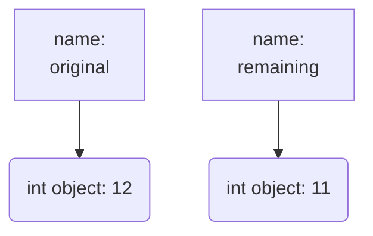
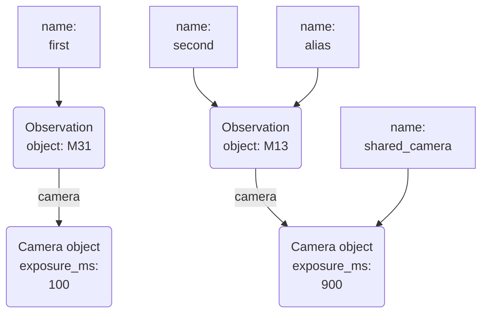
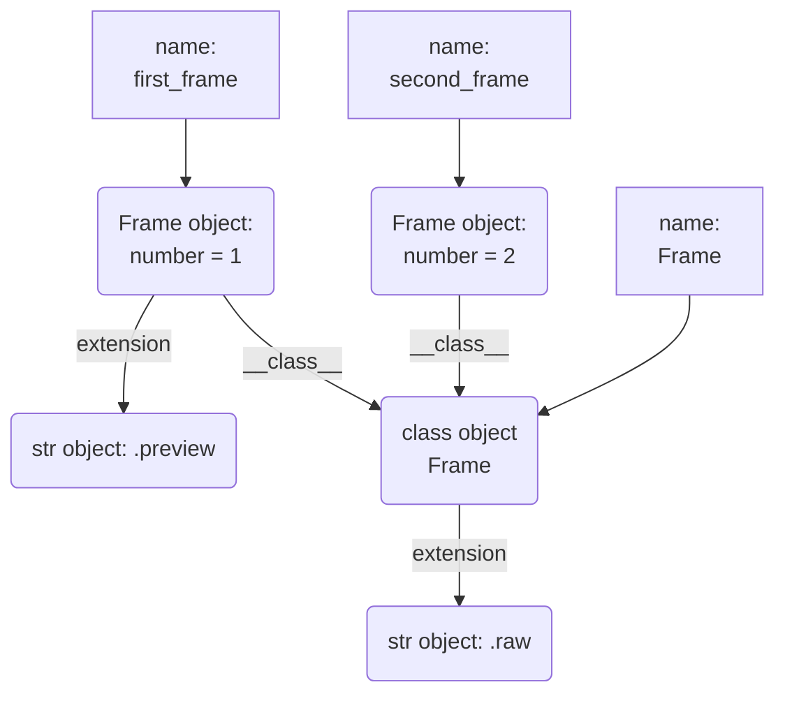
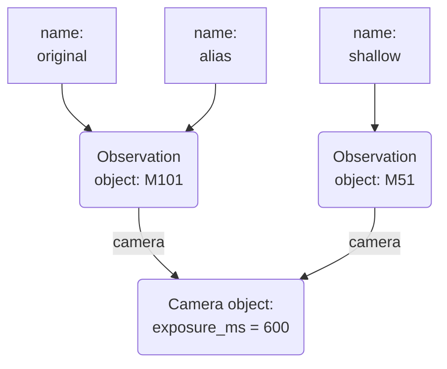
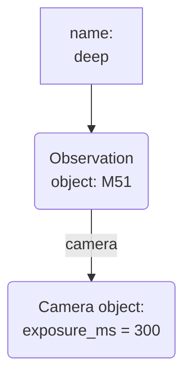
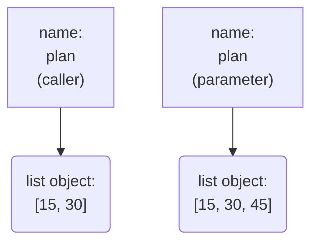
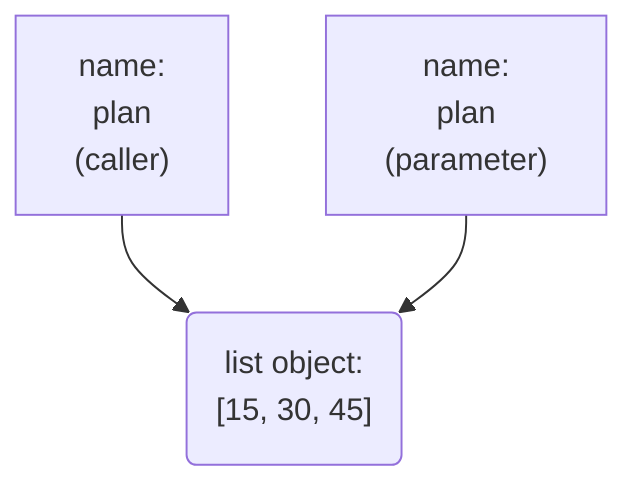

> **Want to practice?** Work through the [Python Essentials interactive tutorial](/SEBook/tools/python-tutorial) — run Python in your browser, repair programs, and check your reasoning with tests and quizzes.

# Python from C++

You already know variables, functions, loops, and classes from C++. Python lets you use those ideas with less declaration syntax, but similar-looking code can behave differently. The durable rule is this: **names, collection elements, and object attributes hold references to objects; assignment and mutation are different operations**.

This chapter uses a robotic observatory to make those differences concrete. By the end, you should be able to trace shared objects, choose an appropriate copying strategy, explain function-call effects, and write a small script that processes observation files. Read the examples in order on a first pass; use the section links as a reference afterward. When you meet a prediction prompt, commit to an answer before opening its explanation.

## The Execution Model: Scripts vs. Binaries

A typical C++ workflow is **write → compile → link → execute**. For a Python script, the command is simply `python3 observe.py`; you do not separately build a native executable.

```python
print("Observatory ready")
```

Python executes top-level statements in order. A function named `main` is an organizational convention, not a required entry point. In CPython, the usual implementation, source is compiled to bytecode and then executed by the interpreter; other implementations can use different execution strategies. “Interpreted” does not mean “never compiled”.

Syntax and indentation errors in a file are detected while it is parsed, before that file's top-level code runs. Many other errors, such as calling an unavailable method, occur only when execution reaches the operation. Optional static analysis can catch some of these earlier.

## Syntax and Scoping: Whitespace Matters

Python uses indentation to group statements into blocks. A colon introduces a block after constructs such as `if`, `for`, `def`, and `class`. Use four spaces per level and avoid mixing tabs and spaces.

```python
for exposure in range(2, 9, 2):
    if exposure >= 6:
        print(f"Long exposure: {exposure} seconds")
```

This prints the lines for 6 and 8 seconds. `range(stop)` starts at zero; `range(start, stop)` supplies a start; `range(start, stop, step)` supplies a stride. The stop is always excluded. A negative step counts downward: `range(3, 0, -1)` produces 3, 2, 1. A range describes its sequence without constructing a list of all its integers.

Indentation groups statements, but **not every block creates a scope**.

## ⚠️ Scoping: The LEGB Rule (A "False Friend" from C++)

Unlike C++, an ordinary `if` or `for` block does not introduce a new local scope:

```python
for exposure in [4, 8, 12]:
    last_exposure = exposure

print(last_exposure)  # 12
```

The names belong to the surrounding function, or to the module if there is no surrounding function. If the loop never executes, it does not create those bindings.

For ordinary name lookup inside functions, **LEGB** means **Local → Enclosing function → Global module → Built-in**:

```python
location = "observatory"

def make_report():
    location = "control room"

    def announce():
        location = "console"
        print(location)

    announce()
    print(location)

make_report()
print(location)
```

The output is `console`, `control room`, then `observatory`, each on its own line. Assigning a bare name in a function normally makes it local to that function. Use `nonlocal` to rebind a name in an enclosing function or `global` to rebind a module-level name. Merely *reading* an outer binding needs neither declaration. Mutating an object reached through an outer binding is different again: it does not itself rebind the name.

## Defining Functions with `def`

A function groups a computation behind a name. Parameters are local names, and `return` supplies a result. A default value lets a caller omit an argument:

```python
def observation_label(target, band="visible"):
    """Return a compact label for an observation."""
    return f"{target} [{band}]"

print(observation_label("M31"))
print(observation_label("M31", band="infrared"))
```

The output is `M31 [visible]` and `M31 [infrared]`. The first statement in this function is a **docstring**, which tools can display as documentation.

A function that reaches its end, or executes a bare `return`, returns the actual object `None`. This is not C++'s `void`: Python's caller still receives a value it can store and inspect.

```python
def announce_target(target):
    print(f"Next target: {target}")

result = announce_target("M13")
print(result is None)  # True
```

Optional type hints document intended inputs and outputs and support static checking; they do not automatically validate calls at runtime:

```python
def total_exposure(count: int, seconds: float) -> float:
    """Return total exposure time for equally long frames."""
    return count * seconds

print(total_exposure(3, 2.5))  # 7.5
```

We will return to what parameter binding means in [Calls & Inheritance](#calls--inheritance), after building the object model it depends on.

# Objects

## The Mental Model of Memory: Dynamic Typing

A C++ declaration such as `int attempts = 12;` gives an object a statically determined type; the size of `int` depends on the implementation, rather than universally being four bytes. C++ also distinguishes value objects, references, and pointers, with different assignment and lifetime rules.

Python uses one consistent starting point: a name is **bound to an object**. An object has an identity, a type, and a value. The name does not acquire a permanent type from its first assignment:

```python
reading = 12
print(type(reading))  # <class 'int'>
reading = "cloudy"
print(type(reading))  # <class 'str'>
reading = 0.75
print(type(reading))  # <class 'float'>
```

The integer did not turn into a string and then a float. The name `reading` was rebound to different objects. This rule includes numbers, strings, Boolean values, containers, and instances of your own classes. Do not invent a separate “primitives are values, instances are references” rule for Python.

An assignment such as `saved = reading` adds a binding to the **same object**. It does not copy the object or make `saved` follow future changes to the name `reading`.

```python
remaining = 12
original = remaining
remaining = remaining - 1
print(original, remaining)  # 12 11
```

In the reference snapshots in this chapter, a rectangular box is a **name binding**, a rounded box is an **object**, and an arrow is a reference. This first snapshot shows the state after the subtraction:



Integers are immutable, so subtraction cannot edit the integer object holding 12. It computes the new value and the assignment rebinds `remaining`. `original` retains its earlier reference. Literal evaluation and immutable-value operations may reuse existing objects, so do not assume every expression allocates a fresh object.

The [Python data model](https://docs.python.org/3/reference/datamodel.html#objects-values-and-types) specifies these observable relationships. CPython manages objects in its runtime heap, but Python source does not offer C++'s choice between an automatic local object and `new`-allocated storage. The portable reasoning tool is object identity and reachability, not a guessed physical address or stack layout.

## `None` and Reachability

`None` is the unique object used to represent absence. Its role can resemble `nullptr` in a design, but it is an ordinary Python object rather than a pointer value:

```python
selected_target = None
print(selected_target is None)  # True
print(type(selected_target))    # <class 'NoneType'>
```

`is` tests object identity; use `is None` and `is not None` for this singleton. Equality, `==`, asks a different question that a class can customize.

**Predict:** after the code below, is the list still accessible, or has assigning `None` destroyed it?

```python
pending = ["M31", "M13"]
saved = pending
pending = None
print(saved)
```

<details markdown="1">
<summary>Check the object lifetime</summary>

It prints `['M31', 'M13']`. Only `pending` was rebound. `saved` still reaches the original list, so that list remains available. An attribute, a container element, or another live reference can keep an object reachable too.

</details>

## Memory Management: RAII vs. Garbage Collection

Python manages object memory, but “a name went away” does not imply “the object was destroyed”. When an object becomes unreachable, it **may be garbage-collected**. Neither assignment to `None` nor `del name` guarantees immediate destruction; `del` removes the binding, not every reference to its object.

CPython uses reference counting together with machinery for collecting reference cycles. That is an implementation detail, not a requirement that all Python implementations share. Cycles, runtime optimizations, and references retained by debuggers complicate simplistic lifetime predictions. Do not use the moment a local name disappears as your resource-cleanup policy.

C++'s Resource Acquisition Is Initialization (RAII) ties resource release to object lifetime. In Python, use a context manager such as `with open(...)` to close a file at the end of a block, including when an exception leaves the block. Reclaiming an object's memory and releasing an external resource are distinct concerns.

# Text & Numbers

## String Quotes: `"..."` and `'...'` Are Interchangeable

Single and double quotes both create `str` objects. Python has no separate character type: indexing a string produces another string of length one.

```python
target = "Andromeda"
same_target = 'Andromeda'
message = "The observer's notes"
quoted = 'Target "M31" is ready'
print(target == same_target)  # True
```

Choose the delimiter that makes the text readable. A double-quoted C++ string can also contain an unescaped apostrophe; the important C++ distinction is that a single-quoted character literal and a double-quoted string literal have different types.

## Immutable Strings and `+=`

**Predict:** will the archived label gain the suffix too?

```python
label = "Deep Sky"
archived_label = label
label += " Survey"
print(label)
print(archived_label)
```

<details markdown="1">
<summary>Trace the two bindings</summary>

The output is `Deep Sky Survey`, then `Deep Sky`. A string cannot be mutated in place. Here `+=` computes a different string value and rebinds `label`; `archived_label` still refers to the old string. The old object remains reachable, so it is not eligible for collection merely because `label` moved.

</details>

This is the same rule as the integer decrement in [Objects](#objects). Do not infer mutation from the spelling `+=`: its effect depends on the operand type. We will contrast it with list mutation below.

## String Formatting: The Magic of f-strings

An f-string evaluates expressions between braces and formats their results. Format specifications control precision, alignment, and other presentation choices:

```python
target = "M57"
seconds = 8.375
print(f"{target}: {seconds:.2f} seconds; two frames: {2 * seconds:.2f}")
# M57: 8.38 seconds; two frames: 16.75
```

The formatting protocol uses `__format__`, with an empty specification when none is written. `!s` explicitly converts with `str()` first, and `!r` with `repr()`. Numeric formatters interpret specifications such as `.2f`; it is inaccurate to say that every f-string simply calls `__str__`. The [format-string documentation](https://docs.python.org/3/library/string.html#format-string-syntax) describes conversion and formatting separately.

## Common String Methods

String methods compute results without editing the original string:

```python
raw = "  Orion FIELD\n"
print(raw.strip())           # Orion FIELD
print(raw.strip().lower())   # orion field
print(raw.strip().upper())   # ORION FIELD
print(raw.lstrip())          # Removes leading whitespace only
print(raw.rstrip())          # Removes trailing whitespace only

fields = "M42,12,infrared".split(",")
print(fields)               # ['M42', '12', 'infrared']
print("north   dome".split())  # ['north', 'dome']
print("M31\nM13\n".splitlines())  # ['M31', 'M13']
print("frame_018.fits".startswith("frame_"))  # True
print("frame_018.fits".endswith(".fits"))     # True
print("infra" in "infrared")                # True
print("north dome".replace("north", "south"))  # south dome
```

`strip()` removes whitespace at **both ends**, not just a line terminator. Use `rstrip("\n")` if spaces in the data must be preserved. For a real comma-separated data format with quoted fields, use the `csv` module rather than assuming every comma separates fields.

## Division Operators: `/` vs `//`

For built-in integers, `/` performs true division and produces a float; `//` performs floor division. Floor means toward negative infinity, which differs from C++ integer division's truncation toward zero:

```python
print(17 / 4)    # 4.25
print(17 // 4)   # 4
print(-17 // 4)  # -5
print(-17 % 4)   # 3: (-5 * 4) + 3 == -17
```

`//` can also receive floats, in which case its result is a float such as `4.0`. Floating-point division is not a promise of exact arithmetic. Choose the operation according to the required rounding behavior, rather than describing `/` as “more precise” in every situation.

## The `**` Exponentiation Operator

```python
print(3 ** 4)    # 81
print(16 ** 0.5) # 4.0
print(3 ^ 4)     # 7: bitwise exclusive-or, not exponentiation
```

Use `**` for powers. As in C++, `^` is a bitwise operation.

## Dynamic ≠ Weak: Python's Strong Typing

Dynamic typing does not mean arbitrary values are silently interchangeable. For example, `"12" + 4` raises `TypeError`. State which conversion you intend:

```python
print(int("12") + 4)  # 16: numeric addition
print("12" + str(4))  # 124: string concatenation
```

Python does define some mixed-type operations, such as integer-plus-float arithmetic. “Strong typing” is a useful informal contrast here, not a claim that Python never performs any conversion.

# Collections

## Core Collections: Lists, Sets, and Dictionaries

Containers store references to objects. Choose a container according to order, duplication, lookup, and mutation requirements; optional type hints do not change those runtime properties.

### Lists (C++ Equivalent: `std::vector`)

A list is an ordered, mutable sequence, but the analogy to `std::vector<T>` has a limit: Python lists can contain references to objects of different types.

```python
record = ["M31", 24, ["clear", "tracked"]]
print(record[0])  # M31
print(record[-1]) # ['clear', 'tracked']

exposures = [5, 10]
exposures.append(20)
print(exposures.pop())  # 20; removes and returns the last member
exposures.remove(5)     # Removes the first matching member
exposures.clear()
print(len(exposures))   # 0
```

CPython implements a list with a dynamically allocated array of object references. Its array slots can therefore refer to strings, numbers, lists, or custom objects without embedding each object's full data in a fixed-type array slot.

For ordinary lists of lengths `n` and `m`, the useful cost model is:

| Operation | Behavior | Time cost in CPython |
|---|---|---|
| `items[i]` | Retrieve a member by index | O(1) |
| `len(items)` | Read the stored size | O(1) |
| `value in items`, `value not in items` | Search members | O(n) worst case |
| `left + right` | Create a new list with both sequences' references | O(n + m) |
| `items.append(value)` | Add one object | O(1) amortized |
| `items.extend(more)` | Add the `m` elements of another list | O(m) amortized |

The membership bound assumes O(1) equality comparisons; custom comparisons can cost more. “Amortized” spreads occasional resize costs across a sequence of operations. One append that resizes can take O(n). The model describes CPython's representation rather than requiring every Python implementation to use identical internals.

**Appending a list and concatenating lists are different operations:**

```python
night = [15, 30]
extra = [45, 60]

nested = night + []
nested.append(extra)
print(nested)  # [15, 30, [45, 60]]

flat = night + extra
print(flat)    # [15, 30, 45, 60]

night.extend(extra)
print(night)   # [15, 30, 45, 60]
```

`append` adds one reference, even when that reference reaches a list. `extend` adds the individual element references. Concatenation creates a new outer list; `append` and `extend` mutate their receiver and return `None`.

### Nested Lists: Mutation and Rebinding

**Predict:** does replacing `late` redirect the second member of `schedule`?

```python
early = [10, 20]
late = [30]
schedule = [early, late]
early[1] = 25
late.append(45)
late = [90]
print(schedule)
print(late)
```

<details markdown="1">
<summary>Follow each stored reference</summary>

The output is `[[10, 25], [30, 45]]`, then `[90]`. Element assignment changes the original early list. Appending changes the original late list. Rebinding the name `late` does not change the reference already stored in `schedule[1]`.

</details>

The same alias can occupy more than one slot. `rows = [[0]] * 3` repeats a reference to one inner list, so `rows[0][0] = 7` is visible through all three slots. To create independent inner lists, evaluate the list construction separately, for example `rows = [[0] for _ in range(3)]`.

### Sets (C++ Equivalent: `std::unordered_set`)

Sets contain unique **hashable** elements and do not promise an iteration order. Hash-based membership is O(1) on average under ordinary hashing assumptions, not a worst-case guarantee.

```python
observed = {"M31", "M13", "M31"}
print(len(observed))       # 2
print("M13" in observed)  # True
print(sorted(observed))    # ['M13', 'M31']
```

Use `set()` for an empty set; `{}` is an empty dictionary. `list(set(sequence))` removes duplicates but does not preserve the original order. Lists are mutable and unhashable, so they cannot themselves be set members.

### Dictionaries (C++ Equivalent: `std::unordered_map`)

A dictionary maps hashable keys to values. Its values can be arbitrary objects. Lookup is O(1) on average under ordinary hashing assumptions, and dictionaries preserve insertion order.

```python
exposure_by_target = {"M31": 20, "M13": 8}
exposure_by_target["M31"] += 5
exposure_by_target["M57"] = 12
print(exposure_by_target["M31"])          # 25
print(exposure_by_target.get("M81", 10))  # 10: fallback for absent key
```

Indexing with a missing key raises `KeyError`; `get` provides a fallback without inserting the key. Values accessed through different keys can still refer to the same mutable object.

### "Pythonic" Iteration

Iterate directly when you need elements, and use `.items()` for dictionary key-value pairs:

```python
for target in ["M31", "M13"]:
    print(target)

for target, seconds in {"M31": 20, "M13": 8}.items():
    print(f"{target}: {seconds} seconds")
```

Index-based loops are appropriate when positions are actually part of the algorithm; they are unnecessary ceremony when only the elements matter.

## `enumerate()` — Index and Value Together

```python
for position, target in enumerate(["M31", "M13"], start=1):
    print(f"{position}. {target}")
```

`enumerate` yields an index and an element together. Here the displayed numbering begins at 1; list indexing still begins at zero.

## Substring Operations and Slicing

`sequence[start:stop:step]` selects a slice. The start is included, the stop is excluded, and the default step is 1. Negative indices count from the end.

```python
filename = "frame_042.fits"
print(filename[:5])    # frame
print(filename[6:9])   # 042
print(filename[-4:])   # fits
print(filename[-1])    # s
print(filename[::2])   # fae02ft
print(filename[::-1])  # stif.240_emarf
```

Built-in lists, strings, and tuples support slicing. A list slice creates a new **shallow** list: its element references are retained. Immutable sequence implementations may reuse the original object for some slices, so do not depend on a string slice producing a distinct identity.

## Tuple Unpacking and Variable Swapping

A tuple groups references in a fixed sequence. Commas create it: `(12, 45)` is a pair, and `(12,)` is a one-element tuple. Unpacking assigns its members to separate names:

```python
coordinates = (120, 35)
azimuth, elevation = coordinates
print(azimuth, elevation)  # 120 35
azimuth, elevation = elevation, azimuth
print(azimuth, elevation)  # 35 120
```

The right-hand side is evaluated before the assignments, so swapping does not lose the old value. This syntax is convenient, but still obeys the reference-binding rule. A tuple cannot replace its member references; a mutable object reached through a tuple can still change.

## List Comprehensions

A comprehension builds a list from an expression, an iteration, and an optional filter:

```python
seconds = [3, 6, 9, 12]
long_exposures = [value * 1000 for value in seconds if value >= 9]
print(long_exposures)  # [9000, 12000]
```

The general form is `[expression for name in iterable if condition]`. Prefer it for a simple transformation. Use a regular loop when several steps, side effects, or complicated branches would make the comprehension harder to read.

### Generator Expressions: Lazy Comprehensions

Parentheses create a generator expression rather than a stored result list:

```python
squared = (value ** 2 for value in range(1, 5))
print(sum(squared))  # 30
print(sum(squared))  # 0: the generator is exhausted
```

A generator retains the state needed to produce values on demand. It avoids storing the whole output sequence, but is not “zero memory”: its iterator and referenced inputs still occupy memory. Use one when a single traversal is enough.

# Instances

## Object-Oriented Programming: Explicit `self` and "Duck Typing"

An ordinary class describes behavior for its instances. Calling it creates an instance and normally calls `__init__` to initialize that instance. Strictly, `__init__` is an initializer; allocation happens before it runs.

```python
class Camera:
    def __init__(self, exposure_ms):
        self.exposure_ms = exposure_ms

    def set_exposure(self, exposure_ms):
        self.exposure_ms = exposure_ms

    def seconds(self):
        return self.exposure_ms / 1000

camera = Camera(250)
print(camera.seconds())  # 0.25
camera.set_exposure(400)
print(camera.seconds())  # 0.4
```

There is no `new` keyword. The dot operator works through the object reference. Python supplies the receiving instance as the first argument to an ordinary bound instance method; the parameter is conventionally named `self`. Thus `camera.set_exposure(400)` corresponds to `Camera.set_exposure(camera, 400)` for this method.

`self.exposure_ms = exposure_ms` stores a reference in the instance. A bare `exposure_ms = ...` inside the method only changes a local binding. Python does not silently prefix member accesses with `self`.

A leading underscore, such as `_sensor_state`, communicates an internal-use convention; it is not C++ access control. Double-leading-underscore names have name-mangling behavior, but that is not a security boundary either.

**Duck typing** means code can use the operations an object provides without demanding a particular inheritance relationship. A function calling `device.seconds()` can work with any suitable object implementing that method. C++ templates and concepts also support behavior-based generic programming; “C++ always requires a shared base class” would be an inaccurate contrast.

## Member Objects Are References Too

Using `Camera` from the preceding example, an observation can share a camera while owning its own notes:

```python
class Observation:
    def __init__(self, target, camera):
        self.target = target
        self.camera = camera
        self.notes = []

    def add_note(self, note):
        self.notes.append(note)

shared_camera = Camera(250)
first = Observation("M31", shared_camera)
second = Observation("M13", shared_camera)
first.add_note("tracking checked")
shared_camera.set_exposure(800)
print(first.camera.exposure_ms, second.camera.exposure_ms)  # 800 800
print(first.notes, second.notes)  # ['tracking checked'] []
```

`self.camera = camera` retains the supplied custom object's identity. It does not embed or clone a camera. `self.notes = []` evaluates a new list construction on every initialization, so the notes lists are independent. A member holding a list and a member holding a custom object follow the same rules; the constructor decides which objects to create and which references to retain.

Now compare these two operations, continuing the example:

```python
first.camera = Camera(100)
print(first.camera.exposure_ms, second.camera.exposure_ms)  # 100 800

alias = second
alias.camera.set_exposure(900)
print(second.camera.exposure_ms)  # 900
```

The first assignment replaces one observation's member reference. It leaves the other observation's member pointing to the original camera. In the second case, `alias` and `second` are names for the same observation, and the method mutates the camera reached through that observation.

The snapshot after both operations omits the notes lists. It writes selected literal attribute values inside objects to keep the references under discussion visible; those attributes still hold references to their values.



**Explain it:** why does creating two observations not necessarily create two cameras? Which line would deliberately create a distinct camera for each observation instead?

<details markdown="1">
<summary>Check the ownership decision</summary>

The Observation initializer stores a reference to the supplied camera, so both calls can receive the same object. Constructing a new Camera inside each initializer would give each observation a separate instance. Whether that is correct depends on the model: two observations may intentionally share one physical instrument. Copying by default would erase that intended relationship.

</details>

## Dunder Methods: `__str__` vs. `operator<<`

Special methods integrate custom classes with language operations. `print(obj)` uses the string representation produced through `str(obj)`; define `__str__` to supply useful display text:

```python
class ExposureSummary:
    def __init__(self, target, seconds):
        self.target = target
        self.seconds = seconds

    def __str__(self):
        return f"{self.target}: {self.seconds} seconds"

summary = ExposureSummary("M81", 18)
print(summary)       # M81: 18 seconds
print(f"{summary!s}")  # M81: 18 seconds
```

The method must return a string. The explicit `!s` conversion uses `str`; an ordinary f-string replacement field uses the formatting protocol discussed earlier. The inherited default formatter delegates an empty format specification to `str`, but a class can define its own `__format__` behavior.

# Class Objects

## A Class Is a Callable Object

Executing a class statement creates a **class object** and binds the class name to it. That object holds class attributes and methods. Instances have their own state and refer to their class.

Using the `Camera` class above:

```python
CameraFactory = Camera
instrument = CameraFactory(500)
print(CameraFactory is Camera)       # True
print(type(instrument) is Camera)     # True
print(type(Camera) is type)           # True
```

`CameraFactory` is another name for the class, not a subclass and not an instance. A class can be passed as an argument or stored in a collection. For this ordinary class, the class object's own type is `type`; more advanced metaclass machinery is not needed to use this model.

## Shared Counters, Individual Identifiers

An archive needs one numbering sequence and a stable number on each frame:

```python
class Frame:
    count = 0
    extension = ".fits"

    def __init__(self, target):
        Frame.count += 1
        self.number = Frame.count
        self.target = target

    def filename(self):
        return f"frame_{self.number:03d}{self.extension}"

first_frame = Frame("M31")
second_frame = Frame("M13")
print(first_frame.filename())   # frame_001.fits
print(second_frame.filename())  # frame_002.fits
print(Frame.count)              # 2
```

`Frame.count` belongs to the class object. `self.number` and `self.target` belong to each instance. Advancing the counter rebinds a class attribute to a new integer; it does not mutate the integer retained by an older frame's `number`.

Writing `self.count += 1` would read a class default if needed, then assign an **instance** attribute. Each fresh instance could therefore start its own counter instead of advancing the shared sequence.

## Lookup and Shadowing

For these ordinary data attributes, lookup checks an instance's own attributes and then its class. An assignment through the instance creates or changes the instance attribute, **shadowing** a class default:

```python
first_frame.extension = ".preview"
Frame.extension = ".raw"
print(first_frame.filename())   # frame_001.preview
print(second_frame.filename())  # frame_002.raw
print(Frame.extension)          # .raw
```

The first frame has an override. The second frame continues to read the current class default. Class defaults are not automatically copied into every instance at construction. Properties and other descriptors extend attribute lookup; this simple rule is the relevant one for the plain attributes shown here.

Here the `__class__` arrows show each instance's reference to its class object. They are references, not steps in an execution trace. The snapshot omits the counter, targets, and methods, and abbreviates each frame's number inside its box.



## A Shared Mutable Attribute

**Predict:** do these observations keep separate rejection lists?

```python
class ReviewBatch:
    rejected = []

    def reject(self, filename):
        self.rejected.append(filename)

north = ReviewBatch()
south = ReviewBatch()
north.reject("blurred_018.fits")
print(south.rejected)
```

<details markdown="1">
<summary>Distinguish lookup from assignment</summary>

It prints `['blurred_018.fits']`. Looking up `self.rejected` finds the list on the class. `append` then mutates that list; it does not create an instance attribute. Both batches therefore reach the same list.

For independent lists, remove the class-level list and initialize `self.rejected = []` in `__init__`. This is the same ownership decision as the per-observation notes list. Shared mutable class state is appropriate only when the sharing is deliberate.

</details>

# Copies & Equality

## Assignment, Shallow Copy, and Deep Copy

Use copying when the program needs a new object, not just a new route to an existing one. In this example, `Camera` and `Observation` are the classes from [Instances](#instances):

```python
import copy

original = Observation("M51", Camera(300))
original.add_note("focus checked")
alias = original
shallow = copy.copy(original)
deep = copy.deepcopy(original)

original.camera.set_exposure(600)
original.add_note("second frame ready")
original.target = "M101"

print(alias.target, shallow.target, deep.target)  # M101 M51 M51
print(alias.camera.exposure_ms,
      shallow.camera.exposure_ms,
      deep.camera.exposure_ms)  # 600 600 300
print(shallow.notes)  # ['focus checked', 'second frame ready']
print(deep.notes)     # ['focus checked']
```

Focus on the camera references after these mutations. These snapshots omit the notes lists and abbreviate target and exposure values inside their objects; the same shallow-versus-deep distinction applies to the notes lists.





Trace the three operations separately:

| Construction | Outer observation | Camera and notes members |
|---|---|---|
| `alias = original` | Same object | Same objects through the same observation |
| `copy.copy(original)` | New observation | References retained from the original |
| `copy.deepcopy(original)` | New observation | Supported mutable members recursively copied |

The shallow observation has its own `target` binding, so rebinding `original.target` does not change it. Its `camera` and `notes` still refer to shared mutable objects. That explains why their mutations are visible through both observations.

For lists, `items.copy()` and `items[:]` make shallow copies. A shallow copy is often exactly right when you want a new sequence of references but still intend to share the referenced objects.

A deep copy is **not** a promise that every reachable value is physically duplicated or that every resource can be cloned. Immutable objects may be reused, classes can customize copying, and files or external resources require their own policies. Deep copying also remembers objects already visited, supporting cycles and preserving repeated references within the copied graph. See the [copy module's contract](https://docs.python.org/3/library/copy.html).

**Predict:** if two original slots share a camera, will a deep copy produce one copied camera or two independent copies?

```python
shared = Camera(700)
source = [shared, shared]
duplicate = copy.deepcopy(source)
print(duplicate[0] is duplicate[1])
print(duplicate[0] is shared)
```

<details markdown="1">
<summary>Check the copied graph</summary>

The output is `True`, then `False`. The two copied slots share one copied camera, distinct from the source camera. Deep copy preserves that internal relationship; it does not blindly clone an object once per reference.

</details>

## Identity and Value Equality

Two objects can represent the same value while remaining distinct objects:

```python
left = [15, 30]
right = [15, 30]
alias = left
print(left == right)  # True: equal list contents
print(left is right)  # False: distinct list objects
print(left is alias)  # True: one object, two names
```

`is` always asks about identity and cannot be customized. `==` follows the objects' equality behavior. A plain user-defined class inheriting `object` and defining no equality method does not automatically compare its attributes: with our `Camera`, `Camera(200) == Camera(200)` is false. Some classes inherit or generate value equality, so “every class without its own `__eq__` compares by identity” is too broad.

Define value equality when the domain has a useful notion of equal values:

```python
class Target:
    def __init__(self, catalog_id, band):
        self.catalog_id = catalog_id
        self.band = band

    def __eq__(self, other):
        if not isinstance(other, Target):
            return NotImplemented
        return (self.catalog_id, self.band) == (other.catalog_id, other.band)

first_target = Target("M31", "infrared")
second_target = Target("M31", "infrared")
print(first_target == second_target)  # True
print(first_target is second_target)  # False
print(first_target == "M31")          # False
```

`isinstance` checks whether the other operand is a Target or a subclass. Returning `NotImplemented` for an unsupported operand gives Python's comparison machinery a chance to use the other operand's implementation; it is different from the Boolean `False` and from raising `NotImplementedError`.

The value definition here includes both the catalog identifier and the band. Defining `__eq__` without a compatible `__hash__` normally makes instances unhashable, which prevents accidental use as dictionary keys under an inconsistent equality policy.

**Recall the earlier string example:** should you compare two target identifiers with `is` or `==`? Use `==` for their text. Python may reuse some equal immutable objects; observing identity once is not a guarantee for future values. Use `is` when sharing itself matters, especially for `None`.

# Calls & Inheritance

## Passing Arguments: "Pass-by-Object-Reference"

A function call binds **new local parameter names to the supplied objects**. The object is not implicitly copied. The caller's name is not passed, and the parameter is not an alias for the caller's variable slot. “Call by sharing” or “pass by object reference” describes this model.

This distinction explains both halves of the rule:

- Rebinding a parameter changes that local binding, even if the original object was mutable.
- Mutating an object reached through a parameter can be observed through the caller's references to the same object.

It resembles passing a pointer value in C++ in that both sides can reach the same object, but Python does not expose pointer arithmetic or let a parameter assignment rebind the caller's local variable.

### Six Calls, One Rule

Use the same initial data for each case. First predict the output, asking **“which binding or object does this statement change?”** rather than “is the parameter mutable?”. The examples use `Camera` from [Instances](#instances).

```python
# 1. Rebind a string parameter.
def prefix_label(label):
    label = "Survey: " + label

label = "Southern Sky"
prefix_label(label)
print(label)

# 2. Concatenate and rebind a list parameter.
def extend_locally(plan):
    plan = plan + [45]

plan = [15, 30]
extend_locally(plan)
print(plan)

# 3. Mutate the supplied list by appending.
def append_exposure(plan):
    plan.append(45)

plan = [15, 30]
append_exposure(plan)
print(plan)

# 4. Replace an element of the supplied list.
def revise_first(plan):
    plan[0] = 5

plan = [15, 30]
revise_first(plan)
print(plan)

# 5. Rebind a parameter to a new custom object.
def replace_camera(camera):
    camera = Camera(900)

camera = Camera(200)
replace_camera(camera)
print(camera.exposure_ms)

# 6. Mutate the supplied custom object through a method.
def configure_camera(camera):
    camera.set_exposure(900)

camera = Camera(200)
configure_camera(camera)
print(camera.exposure_ms)
```

<details markdown="1">
<summary>Check all six effects</summary>

The output is:

```text
Southern Sky
[15, 30]
[15, 30, 45]
[5, 30]
200
900
```

Cases 1, 2, and 5 rebind only a parameter. In case 2, even though the original list is mutable, `+` builds a different list and the caller's binding stays unchanged. Cases 3, 4, and 6 mutate an object the caller still reaches. Replacing a list element is mutation of the list, not reassignment of the caller's list variable.

These two snapshots pause each call just after its body statement, before it returns and the parameter binding ends. List elements are abbreviated as values inside their list objects; the lists themselves contain references to those integers.





</details>

If you want a replacement to become the caller's new value, return it and assign it at the call site:

```python
def extended_plan(plan):
    return plan + [45]

plan = [15, 30]
plan = extended_plan(plan)
print(plan)  # [15, 30, 45]
```

For a built-in list, `plan += [45]` extends the list in place, so aliases observe its new member. For a string, `label += " Survey"` cannot mutate the string and instead rebinds the name. The same augmented-assignment spelling does not imply the same object-level effect for every type.

### Mutable Default Arguments

Default expressions are evaluated when the function definition executes, not afresh for each call. A mutable default can therefore keep state between calls:

```python
def remember_target(target, targets=[]):
    targets.append(target)
    return targets

print(remember_target("M31"))  # ['M31']
print(remember_target("M13"))  # ['M31', 'M13']
```

Both calls omitted the argument and received the same default list. The list stays reachable through the function's stored defaults. This affects dictionaries, sets, and mutable custom objects too; it is not a special exception to parameter passing.

Use a sentinel when omitted input should create a fresh container:

```python
def remember_target(target, targets=None):
    if targets is None:
        targets = []
    targets.append(target)
    return targets

print(remember_target("M31"))  # ['M31']
print(remember_target("M13"))  # ['M13']
provided = []
print(remember_target("M57", provided))  # ['M57']
print(provided)                           # ['M57']
```

The function's contract now distinguishes omitted/`None` input from an explicitly supplied list, which it deliberately mutates. `if not targets` would also replace a caller-supplied empty list, breaking that contract. The `is None` test is an ownership decision, not just a style preference. The [Python tutorial on defaults](https://docs.python.org/3/tutorial/controlflow.html#default-argument-values) documents the definition-time evaluation rule.

## Inheritance, Initialization, and Dispatch

Inheritance reuses behavior, but a subclass that defines its own `__init__` does not automatically run its base initializer. If base initialization is needed, call it explicitly. If a subclass defines **no** `__init__`, it can inherit one normally.

```python
class Detector:
    def __init__(self, name):
        self.name = name
        print("Detector setup:", name)

    def capture(self):
        print(self.name, self.readout())

    def readout(self):
        return "visible"

class InfraredDetector(Detector):
    def __init__(self, name):
        super().__init__(name)
        print("Infrared mode ready")

    def readout(self):
        return "infrared"

    def reference_readout(self):
        return super().readout()

instrument = InfraredDetector("IR-2")
print(instrument.reference_readout())
instrument.capture()
```

**Predict:** does the inherited `capture()` use the base `readout()` or the override?

<details markdown="1">
<summary>Trace initialization and method selection</summary>

The output is:

```text
Detector setup: IR-2
Infrared mode ready
visible
IR-2 infrared
```

`super().__init__(name)` initializes the name on the same instance. `reference_readout()` explicitly asks `super()` for the next implementation, which here is Detector.readout. The inherited `capture()` still has an InfraredDetector as `self`, so its call to `self.readout()` dispatches to the override.

</details>

If the subclass removed `super().__init__(name)`, the base initialization message would disappear and `self.name` would be missing; the inherited `capture()` would raise `AttributeError`. Calling a base initializer initializes the same object, not a second embedded base object.

`super()` follows the method resolution order; in this single-inheritance example, that means the base class. Ordinary overridden instance methods dispatch dynamically without a C++-style `virtual` declaration. Inherited method code does not “freeze” `self` to the base type. See [Python's inheritance documentation](https://docs.python.org/3/tutorial/classes.html#inheritance).

# Scripting

## Exception Handling: `try` / `except`

Catch failures at the point where you can respond usefully, and keep the protected operation narrow:

```python
raw_seconds = "cloudy"
try:
    seconds = int(raw_seconds)
except ValueError:
    print("Exposure must be a whole number of seconds")
```

A broad handler can hide unrelated bugs. A bare `except:` also catches exceptions such as `KeyboardInterrupt`; use specific exception types for expected failure modes. Broad exception handling has legitimate boundary uses, but should not be the default around routine computations.

### EAFP vs. LBYL: A Python Philosophy Shift

**EAFP** means “Easier to Ask Forgiveness than Permission”: try an operation and handle a relevant failure. **LBYL** means “Look Before You Leap”: check a precondition first. Both can be appropriate in Python and C++; choose according to the operation and the contract.

```python
settings = {"band": "infrared"}
try:
    retries = settings["retries"]
except KeyError:
    retries = 2

# For this simple fallback, get() expresses the same requirement directly.
retries = settings.get("retries", 2)
print(retries)  # 2
```

Do not make blanket performance claims about “cheap Python exceptions”. More importantly, checking that a file exists and then opening it cannot guarantee it remains present between the two operations. Handle the failure of the operation that actually matters.

### Common Built-in Exception Types

| Exception | Typical cause |
|---|---|
| `SyntaxError` | Source cannot be parsed |
| `IndentationError` | Invalid block indentation; `TabError` specializes it |
| `NameError` | A name is not bound where it is read |
| `TypeError` | An operation or argument type is inappropriate |
| `ValueError` | The type is accepted but the value is not |
| `IndexError` | A sequence index is out of range |
| `KeyError` | A dictionary key is absent |
| `FileNotFoundError` | A requested filesystem path does not exist |
| `ZeroDivisionError` | A division or modulo divisor is zero |
| `AttributeError` | The requested attribute is unavailable |

## Reading Files with `open()` and `with`

Save a text file named `targets.txt` containing two lines, `M31` and `M13`. This script reads it without loading the entire file:

```python
with open("targets.txt", encoding="utf-8") as source:
    for line in source:
        print(line.rstrip("\n"))
```

The context manager closes the file when the block exits, including through an exception. This cleanup is independent of when Python collects the file object's memory.

Choose the read operation according to the data size and desired result:

```python
with open("targets.txt", encoding="utf-8") as source:
    content = source.read()       # One string containing the entire file
    lines = content.splitlines()  # List of lines without their terminators

with open("targets.txt", encoding="utf-8") as source:
    lines = source.readlines()    # List retaining any line terminators
```

The last line in a file need not have a newline. Iterate directly over the file for a large input. To write text, use `open(path, "w", encoding="utf-8")`; the `"w"` mode truncates an existing file, whereas `"a"` appends. A context manager runs its cleanup protocol; what “cleanup” means depends on the resource, so do not assume every database context manager closes its connection.

## Command-Line Arguments with `sys.argv` and `sys.stderr`

Save this example as `show_targets.py` and run `python3 show_targets.py targets.txt`:

```python
import sys

if len(sys.argv) != 2:
    print("Usage: python3 show_targets.py FILE", file=sys.stderr)
    sys.exit(2)

try:
    with open(sys.argv[1], encoding="utf-8") as source:
        for line in source:
            print(line.rstrip("\n"))
except OSError as error:
    print(f"Cannot read target file: {error}", file=sys.stderr)
    sys.exit(1)
```

For this script invocation, `sys.argv[0]` is the script path and subsequent elements are argument strings. `print()` writes to standard output by default; `file=sys.stderr` separates diagnostics from useful output. A nonzero exit status tells a calling shell or program that the script failed.

## Robust Command-Line Arguments (`argparse`)

When a script has flags or typed options, `argparse` handles parsing and generates help. Save this as `exposure_plan.py`:

```python
import argparse

parser = argparse.ArgumentParser(description="Plan an observatory exposure")
parser.add_argument("target")
parser.add_argument("--seconds", type=float, default=10.0)
args = parser.parse_args()
if args.seconds <= 0:
    parser.error("--seconds must be positive")
print(f"{args.target}: {args.seconds:g} seconds")
```

`python3 exposure_plan.py M31 --seconds 12.5` prints `M31: 12.5 seconds`. `--help` describes the interface. The `type=float` conversion checks numeric syntax; the explicit comparison checks the separate domain rule that the duration is positive.

## Regular Expressions (`re` module)

Regular expressions describe text patterns; Python's `re` module can search, extract, and replace matches:

```python
import re

log = "frame=018 exposure=12s; frame=019 exposure=8s"
match = re.search(r"exposure=(\d+)s", log)
if match:
    print(match.group(0))  # exposure=12s: whole match
    print(match.group(1))  # 12: first capturing group

print(re.findall(r"frame=(\d+)", log))  # ['018', '019']
print(re.sub(r"frame=\d+", "frame=hidden", log))
# frame=hidden exposure=12s; frame=hidden exposure=8s
```

`search` returns the first match object or `None`; `findall` returns all matches, with the result shape affected by capturing groups; `sub` returns replaced text. Raw string literals such as `r"\d+"` keep Python's string parser from interpreting those backslashes before the pattern parser sees them. Raw strings are usually clearer for regular expressions, although a pattern without backslashes does not require one.

## OpenCL Sidebar: Parallel Work on Many Elements

Python can coordinate a scientific computation while a different language executes a demanding parallel kernel. **OpenCL** (Open Computing Language) is a Khronos standard for programming heterogeneous devices, including central and graphics processors. Its first specification was released in 2008. Portability depends on supported device capabilities and versions; it does not mean every kernel runs unchanged or equally fast on every device. [Khronos's OpenCL overview](https://www.khronos.org/opencl/) and [OpenCL 1.0 announcement](https://www.khronos.org/news/press/the_khronos_group_releases_opencl_1.0_specification) describe this scope.

For example, an observatory could flag saturated image pixels with this C-based OpenCL kernel. Each output byte is 1 if the input reaches the threshold and 0 otherwise:

```c
__kernel void mark_saturation(__global const float* input,
                              __global uchar* saturated,
                              const float threshold,
                              const int count) {
    const size_t index = get_global_id(0);
    if (index < count) {
        saturated[index] = input[index] >= threshold;
    }
}
```

A host program launches many **work-items**. Each work-item uses its global identifier to select an element, and the bounds check protects extra work-items if the launch size is rounded up. The host must still allocate buffers, transfer data where necessary, and launch the kernel; the kernel alone is not a runnable Python script. Launching many work-items does not promise one physical processor core per work-item. The useful contrast is automatic Python object management versus explicitly organized, data-parallel device computation.

## Top 10 Python Best Practices

These choices summarize the chapter's reasoning rather than replacing it. Use them when they express the program's contract clearly.

### 1. Use f-Strings for String Formatting

Put values and format specifications next to the surrounding text. Keep in mind that formatting, string conversion, and representation are distinct protocols.

### 2. Use `with` for Resource Management

Tie file cleanup to a visible block boundary instead of depending on garbage-collection timing.

### 3. Iterate Directly Over Collections

When the element is all you need, read the element directly. Use indices when the algorithm actually depends on positions.

### 4. Use `enumerate()` When You Need the Index

Keep position and element together without maintaining a separate counter.

### 5. Follow PEP 8 Naming Conventions

Use `snake_case` for functions and variables, `PascalCase` for classes, and `UPPER_SNAKE_CASE` for constants. A leading underscore communicates internal-use intent.

### 6. Use List Comprehensions for Simple Transformations

Choose a comprehension for a short mapping or filter. Prefer a loop when it makes several operations easier to understand.

### 7. Catch Specific Exceptions

Catch errors you can handle meaningfully, and avoid swallowing unrelated bugs inside an oversized `try` block.

### 8. Use `None` as a Sentinel for Mutable Default Arguments

Allocate a fresh container in the body when omission means independent state. Preserve a caller-supplied empty container when the contract says to mutate it.

### 9. Use Truthiness for Empty Collection Checks

`if not items:` is a direct empty-collection check. Distinguish empty values from absence when zero, an empty string, or an empty collection is valid input.

### 10. Use `is` for `None` Comparisons

Use identity for the `None` singleton and equality for domain values. A customizable `__eq__` does not change what `is` means.

# Practice

Before opening the cards, explain three contrasts without looking back: rebinding versus mutation; a shallow copy versus a deep copy; and class state versus instance state. Then trace one function call in which a mutable argument **does not** change. Return to these questions after a break, and use the [interactive Python tutorial](/SEBook/tools/python-tutorial) to test the same ideas with different examples.






