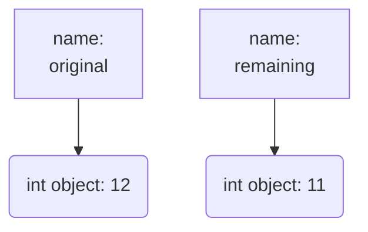
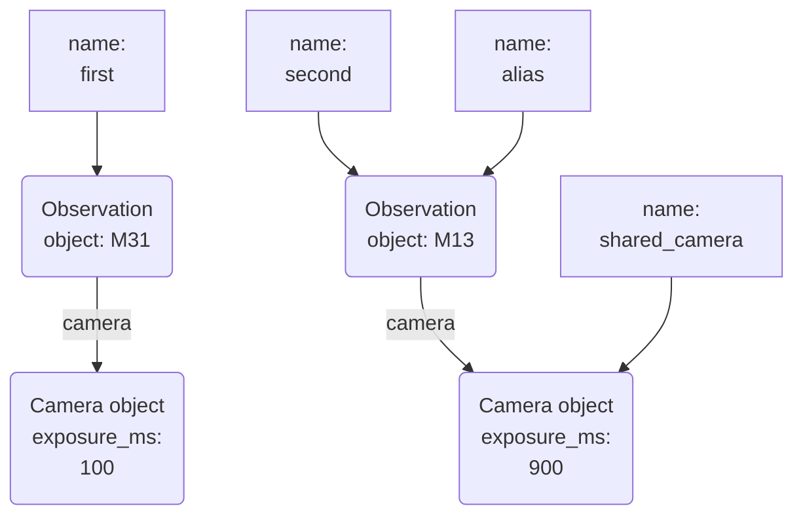
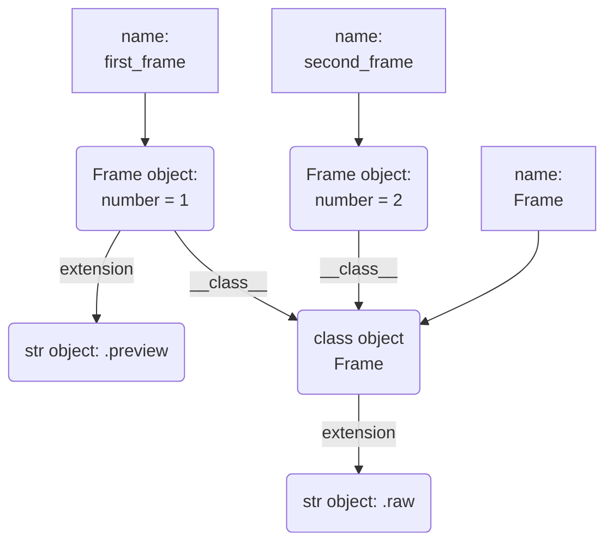
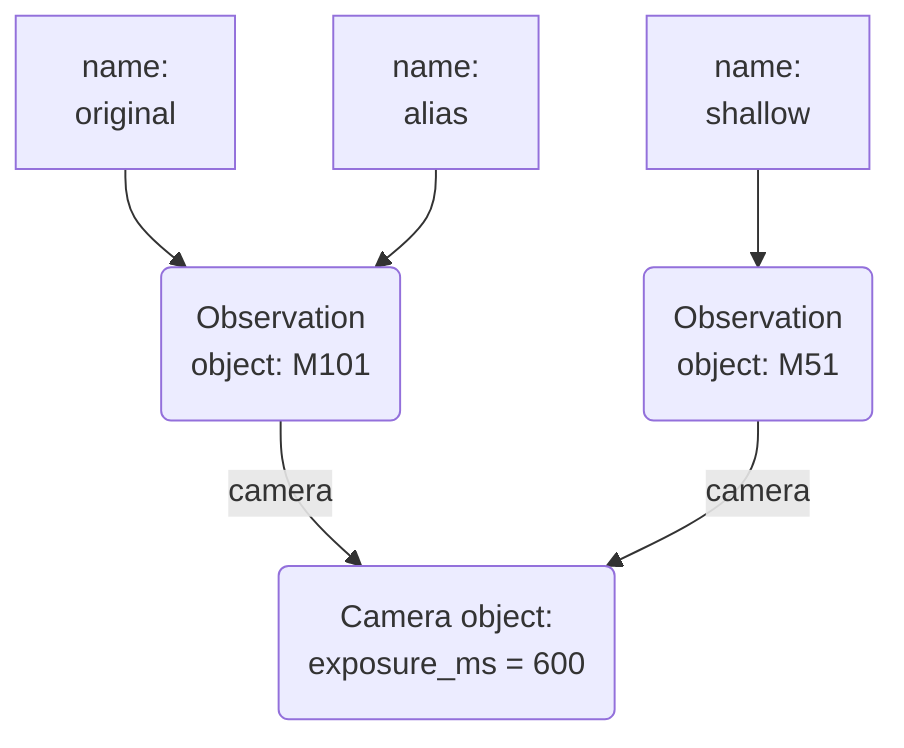
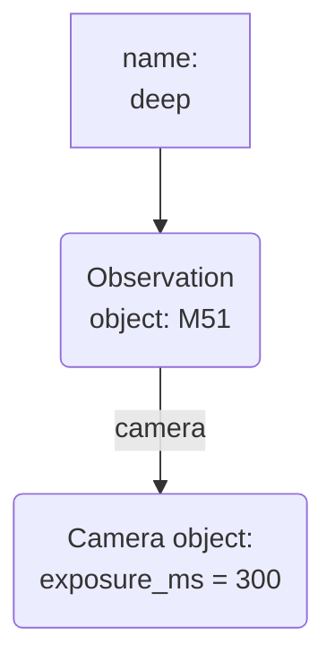
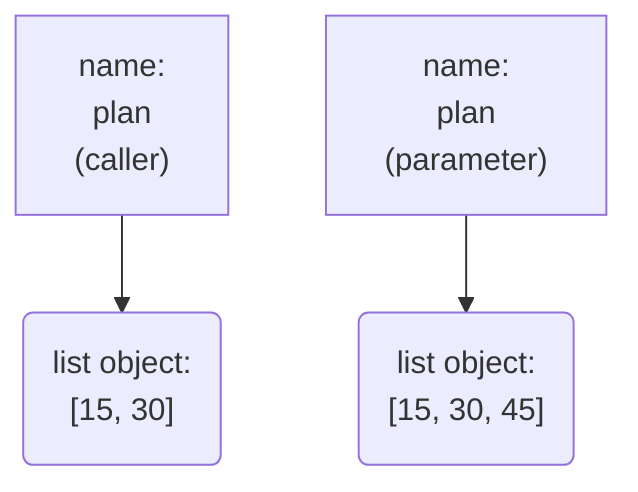
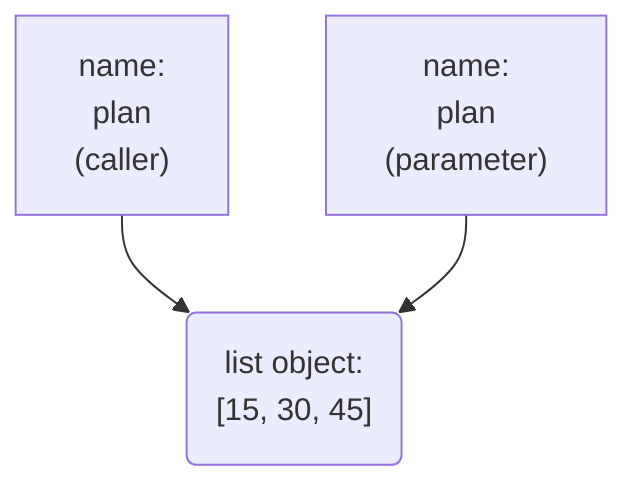

<script src="/js/object-reference-graph.js" defer></script>
<script src="/js/object-reference-code.js" defer></script>
<script src="/js/object-reference-print.js" defer></script>
<script src="/js/object-reference-lab.js" defer></script>
<link rel="stylesheet" href="/css/object-reference-lab.css">
<script src="/js/unix-command-lab.js" defer></script>
<script src="/js/program-output-lab.js" defer></script>
<link rel="stylesheet" href="/css/unix-command-lab.css">
<link rel="stylesheet" href="/css/program-output-lab.css">
<link rel="stylesheet" href="/css/print-light.css">

> **Want to practice?** Work through the [Python Essentials interactive tutorial](/SEBook/tools/python-tutorial) — run Python in your browser, repair programs, and check your reasoning with tests and quizzes.

# Python from C++

You already know variables, functions, loops, and classes from C++. Python lets you use those ideas with less declaration syntax, but similar-looking code can behave differently. The durable rule is this: **names, collection elements, and object attributes hold references to objects; assignment and mutation are different operations**.

The observatory examples establish that model; later examples use work queues, inventory, and recursive data to practice transferring it. By the end, you should be able to trace shared objects, choose a copying boundary, explain calls and defaults, and use Python's functions, classes, iteration, and error handling in a larger program. When you meet a prediction prompt, commit to an answer before opening its explanation.

For CS131, read in three passes: **Objects through Calls & Inheritance** for reference semantics; **Functions & Iteration** for closures, recursive programs, and lazy traversal; then **Scripting** for environments, modules, exceptions, and concurrency. The examples practice the kinds of reasoning used in the course's lectures, homework, and assessments with new programs. The [course practice](#practice) includes both output prediction and writing small repairs.

## The Execution Model: Scripts vs. Binaries

A typical C++ workflow is **write → compile → link → execute**. For a Python script, the command is simply `python3 observe.py`; you do not separately build a native executable.

```python
print("Observatory ready")
```

Python executes top-level statements in order. A function named `main` is an organizational convention, not a required entry point. In CPython, the usual implementation, source is compiled to bytecode and then executed by the interpreter; other implementations can use different execution strategies. “Interpreted” does not mean “never compiled”.

Syntax and indentation errors in a file are detected while it is parsed, before that file's top-level code runs. Many other errors, such as calling an unavailable method, occur only when execution reaches the operation. Optional static analysis can catch some of these earlier.

## Syntax and Scoping: Whitespace Matters

Python uses indentation to group statements into blocks. A colon introduces a block after constructs such as `if`, `for`, `def`, and `class`. Use four spaces per level and avoid mixing tabs and spaces.

```python
for exposure in range(2, 9, 2):
    if exposure >= 6:
        print(f"Long exposure: {exposure} seconds")
```

This prints the lines for 6 and 8 seconds. `range(stop)` starts at zero; `range(start, stop)` supplies a start; `range(start, stop, step)` supplies a stride. The stop is always excluded. A negative step counts downward: `range(3, 0, -1)` produces 3, 2, 1. A range describes its sequence without constructing a list of all its integers.

Indentation groups statements, but **not every block creates a scope**.

## ⚠️ Scoping: The LEGB Rule (A "False Friend" from C++)

Unlike C++, an ordinary `if` or `for` block does not introduce a new local scope:

```python
for exposure in [4, 8, 12]:
    last_exposure = exposure

print(last_exposure)  # 12
```

The names belong to the surrounding function, or to the module if there is no surrounding function. If the loop never executes, it does not create those bindings.

For ordinary name lookup inside functions, **LEGB** means **Local → Enclosing function → Global module → Built-in**:

```python
location = "observatory"

def make_report():
    location = "control room"

    def announce():
        location = "console"
        print(location)

    announce()
    print(location)

make_report()
print(location)
```

The output is `console`, `control room`, then `observatory`, each on its own line. Assigning a bare name in a function normally makes it local to that function. Use `nonlocal` to rebind a name in an enclosing function or `global` to rebind a module-level name. Merely *reading* an outer binding needs neither declaration. Mutating an object reached through an outer binding is different again: it does not itself rebind the name.

### When a Local Name Exists but Has No Value

Python determines ordinary function-local names from assignments in the function body, before running that body. It does not fall back to a global just because the local has not been assigned yet:

```python
quota = 8

def reserve():
    print(quota)
    quota = 3

try:
    reserve()
except UnboundLocalError:
    print("The local quota has no value yet")
```

Removing the assignment makes the read use the global `quota`. Adding `global quota` explicitly permits rebinding the module name; returning a new quota is often a clearer interface. A Python 3 comprehension also has its own iteration-variable scope: after `n = 9; squares = [n * n for n in range(3)]`, the outer `n` is still 9. This differs from an ordinary `for` statement.

## Defining Functions with `def`

A function groups a computation behind a name. Parameters are local names, and `return` supplies a result. A default value lets a caller omit an argument:

```python
def observation_label(target, band="visible"):
    """Return a compact label for an observation."""
    return f"{target} [{band}]"

print(observation_label("M31"))
print(observation_label("M31", band="infrared"))
```

The output is `M31 [visible]` and `M31 [infrared]`. The first statement in this function is a **docstring**, which tools can display as documentation.

A function that reaches its end, or executes a bare `return`, returns the actual object `None`. This is not C++'s `void`: Python's caller still receives a value it can store and inspect.

```python
def announce_target(target):
    print(f"Next target: {target}")

result = announce_target("M13")
print(result is None)  # True
```

Optional type hints document intended inputs and outputs and support static checking; they do not automatically validate calls at runtime:

```python
def total_exposure(count: int, seconds: float) -> float:
    """Return total exposure time for equally long frames."""
    return count * seconds

print(total_exposure(3, 2.5))  # 7.5
```

We will return to what parameter binding means in [Calls & Inheritance](#calls--inheritance), after building the object model it depends on.

# Objects

## The Mental Model of Memory: Dynamic Typing

A C++ declaration such as `int attempts = 12;` gives an object a statically determined type; the size of `int` depends on the implementation, rather than universally being four bytes. C++ also distinguishes value objects, references, and pointers, with different assignment and lifetime rules.

Python uses one consistent starting point: a name is **bound to an object**. An object has an identity, a type, and a value. The name does not acquire a permanent type from its first assignment:

```python
reading = 12
print(type(reading))  # <class 'int'>
reading = "cloudy"
print(type(reading))  # <class 'str'>
reading = 0.75
print(type(reading))  # <class 'float'>
```

The integer did not turn into a string and then a float. The name `reading` was rebound to different objects. This rule includes numbers, strings, Boolean values, containers, and instances of your own classes. Do not invent a separate “primitives are values, instances are references” rule for Python.

An assignment such as `saved = reading` adds a binding to the **same object**. It does not copy the object or make `saved` follow future changes to the name `reading`.

```python
remaining = 12
original = remaining
remaining = remaining - 1
print(original, remaining)  # 12 11
```

In the reference snapshots in this chapter, a rectangular box is a **name binding**, a rounded box is an **object**, and an arrow is a reference. This first snapshot shows the state after the subtraction:


```mermaid
%% caption: Rebinding remaining leaves original referring to 12.
flowchart TB
  accTitle: Two names after integer rebinding
  accDescr: After the subtraction, original refers to the integer object 12, while remaining refers to the integer object 11. Rebinding remaining did not change the object reached through original.
  originalName["name:<br/>original"] --> twelve("int object: 12")
  remainingName["name:<br/>remaining"] --> eleven("int object: 11")
```

Integers are immutable, so subtraction cannot edit the integer object holding 12. It computes the new value and the assignment rebinds `remaining`. `original` retains its earlier reference. Literal evaluation and immutable-value operations may reuse existing objects, so do not assume every expression allocates a fresh object.

The [Python data model](https://docs.python.org/3/reference/datamodel.html#objects-values-and-types) specifies these observable relationships. CPython manages objects in its runtime heap, but Python source does not offer C++'s choice between an automatic local object and `new`-allocated storage. The portable reasoning tool is object identity and reachability, not a guessed physical address or stack layout.

## `None` and Reachability

`None` is the unique object used to represent absence. Its role can resemble `nullptr` in a design, but it is an ordinary Python object rather than a pointer value:

```python
selected_target = None
print(selected_target is None)  # True
print(type(selected_target))    # <class 'NoneType'>
```

`is` tests object identity; use `is None` and `is not None` for this singleton. Equality, `==`, asks a different question that a class can customize.

**Predict:** after the code below, is the list still accessible, or has assigning `None` destroyed it?

```python
pending = ["M31", "M13"]
saved = pending
pending = None
print(saved)
```

<details markdown="1">
<summary>Check the object lifetime</summary>

It prints `['M31', 'M13']`. Only `pending` was rebound. `saved` still reaches the original list, so that list remains available. An attribute, a container element, or another live reference can keep an object reachable too.

</details>

## Memory Management: RAII vs. Garbage Collection

Python manages object memory, but “a name went away” does not imply “the object was destroyed”. When an object becomes unreachable, it **may be garbage-collected**. Neither assignment to `None` nor `del name` guarantees immediate destruction; `del` removes the binding, not every reference to its object.

CPython uses reference counting together with machinery for collecting reference cycles. That is an implementation detail, not a requirement that all Python implementations share. Cycles, runtime optimizations, and references retained by debuggers complicate simplistic lifetime predictions. Do not use the moment a local name disappears as your resource-cleanup policy.

C++'s Resource Acquisition Is Initialization (RAII) ties resource release to object lifetime. In Python, use a context manager such as `with open(...)` to close a file at the end of a block, including when an exception leaves the block. Reclaiming an object's memory and releasing an external resource are distinct concerns.

# Text & Numbers

## String Quotes: `"..."` and `'...'` Are Interchangeable

Single and double quotes both create `str` objects. Python has no separate character type: indexing a string produces another string of length one.

```python
target = "Andromeda"
same_target = 'Andromeda'
message = "The observer's notes"
quoted = 'Target "M31" is ready'
print(target == same_target)  # True
```

Choose the delimiter that makes the text readable. A double-quoted C++ string can also contain an unescaped apostrophe; the important C++ distinction is that a single-quoted character literal and a double-quoted string literal have different types.

## Immutable Strings and `+=`

**Predict:** will the archived label gain the suffix too?

```python
label = "Deep Sky"
archived_label = label
label += " Survey"
print(label)
print(archived_label)
```

<details markdown="1">
<summary>Trace the two bindings</summary>

The output is `Deep Sky Survey`, then `Deep Sky`. A string cannot be mutated in place. Here `+=` computes a different string value and rebinds `label`; `archived_label` still refers to the old string. The old object remains reachable, so it is not eligible for collection merely because `label` moved.

</details>

This is the same rule as the integer decrement in [Objects](#objects). Do not infer mutation from the spelling `+=`: its effect depends on the operand type. We will contrast it with list mutation below.

## String Formatting: The Magic of f-strings

An f-string evaluates expressions between braces and formats their results. Format specifications control precision, alignment, and other presentation choices:

```python
target = "M57"
seconds = 8.375
print(f"{target}: {seconds:.2f} seconds; two frames: {2 * seconds:.2f}")
# M57: 8.38 seconds; two frames: 16.75
```

The formatting protocol uses `__format__`, with an empty specification when none is written. `!s` explicitly converts with `str()` first, and `!r` with `repr()`. Numeric formatters interpret specifications such as `.2f`; it is inaccurate to say that every f-string simply calls `__str__`. The [format-string documentation](https://docs.python.org/3/library/string.html#format-string-syntax) describes conversion and formatting separately.

## Common String Methods

String methods compute results without editing the original string:

```python
raw = "  Orion FIELD\n"
print(raw.strip())           # Orion FIELD
print(raw.strip().lower())   # orion field
print(raw.strip().upper())   # ORION FIELD
print(raw.lstrip())          # Removes leading whitespace only
print(raw.rstrip())          # Removes trailing whitespace only

fields = "M42,12,infrared".split(",")
print(fields)               # ['M42', '12', 'infrared']
print("north   dome".split())  # ['north', 'dome']
print("M31\nM13\n".splitlines())  # ['M31', 'M13']
print("frame_018.fits".startswith("frame_"))  # True
print("frame_018.fits".endswith(".fits"))     # True
print("infra" in "infrared")                # True
print("north dome".replace("north", "south"))  # south dome
```

`strip()` removes whitespace at **both ends**, not just a line terminator. Use `rstrip("\n")` if spaces in the data must be preserved. For a real comma-separated data format with quoted fields, use the `csv` module rather than assuming every comma separates fields.

## Division Operators: `/` vs `//`

For built-in integers, `/` performs true division and produces a float; `//` performs floor division. Floor means toward negative infinity, which differs from C++ integer division's truncation toward zero:

```python
print(17 / 4)    # 4.25
print(17 // 4)   # 4
print(-17 // 4)  # -5
print(-17 % 4)   # 3: (-5 * 4) + 3 == -17
```

`//` can also receive floats, in which case its result is a float such as `4.0`. Floating-point division is not a promise of exact arithmetic. Choose the operation according to the required rounding behavior, rather than describing `/` as “more precise” in every situation.

## The `**` Exponentiation Operator

```python
print(3 ** 4)    # 81
print(16 ** 0.5) # 4.0
print(3 ^ 4)     # 7: bitwise exclusive-or, not exponentiation
```

Use `**` for powers. As in C++, `^` is a bitwise operation.

## Dynamic ≠ Weak: Python's Strong Typing

Dynamic typing does not mean arbitrary values are silently interchangeable. For example, `"12" + 4` raises `TypeError`. State which conversion you intend:

```python
print(int("12") + 4)  # 16: numeric addition
print("12" + str(4))  # 124: string concatenation
```

Python does define some mixed-type operations, such as integer-plus-float arithmetic. “Strong typing” is a useful informal contrast here, not a claim that Python never performs any conversion.

# Collections

## Core Collections: Lists, Sets, and Dictionaries

Containers store references to objects. Choose a container according to order, duplication, lookup, and mutation requirements; optional type hints do not change those runtime properties.

### Lists (C++ Equivalent: `std::vector`)

A list is an ordered, mutable sequence, but the analogy to `std::vector<T>` has a limit: Python lists can contain references to objects of different types.

```python
record = ["M31", 24, ["clear", "tracked"]]
print(record[0])  # M31
print(record[-1]) # ['clear', 'tracked']

exposures = [5, 10]
exposures.append(20)
print(exposures.pop())  # 20; removes and returns the last member
exposures.remove(5)     # Removes the first matching member
exposures.clear()
print(len(exposures))   # 0
```

CPython implements a list with a dynamically allocated array of object references. Its array slots can therefore refer to strings, numbers, lists, or custom objects without embedding each object's full data in a fixed-type array slot.

For ordinary lists of lengths `n` and `m`, the useful cost model is:

| Operation | Behavior | Time cost in CPython |
|---|---|---|
| `items[i]` | Retrieve a member by index | O(1) |
| `len(items)` | Read the stored size | O(1) |
| `value in items`, `value not in items` | Search members | O(n) worst case |
| `left + right` | Create a new list with both sequences' references | O(n + m) |
| `items.append(value)` | Add one object | O(1) amortized |
| `items.extend(more)` | Add the `m` elements of another list | O(m) amortized |

The membership bound assumes O(1) equality comparisons; custom comparisons can cost more. “Amortized” spreads occasional resize costs across a sequence of operations. One append that resizes can take O(n). The model describes CPython's representation rather than requiring every Python implementation to use identical internals.

**Appending a list and concatenating lists are different operations:**

```python
night = [15, 30]
extra = [45, 60]

nested = night + []
nested.append(extra)
print(nested)  # [15, 30, [45, 60]]

flat = night + extra
print(flat)    # [15, 30, 45, 60]

night.extend(extra)
print(night)   # [15, 30, 45, 60]
```

`append` adds one reference, even when that reference reaches a list. `extend` adds the individual element references. Concatenation creates a new outer list; `append` and `extend` mutate their receiver and return `None`.

### Nested Lists: Mutation and Rebinding

Predict which object changes and which stored reference moves in the lab below.
After the append, inspect both board slots; after the assignment, compare them
again. Printing the same contents twice does not establish that there are two
inner objects.

Use **Forward** and **Back** to inspect recorded states. After predicting the
variation under **Try one change**, edit the code. It retraces automatically
and returns to the same step number (or the last available step). Each object
has its own card, including strings and numbers: a name and a list slot can
point to the same value object. **Restart** returns to step 1 with your code;
**Restore original code** brings back the prepared example.



The same issue arises with repetition: `rows = [[0]] * 3` repeats a reference
to one inner list. Before trying `rows[0].append(7)`, predict how many slots
will display the added value. Independent rows require evaluating a list
construction separately for each row; [List Comprehensions](#list-comprehensions)
returns to that distinction.

### Arrays of References: Slots Are Separate from Their Objects

The course's Python “array” examples use **lists**. A list is not a fixed-size C++ array of embedded objects: replacing a slot, changing a referenced object, and rebinding the list's name are three different operations. The standard-library `array.array` instead stores constrained numeric values; a NumPy array has its own slicing and view rules. Apply the rules here to built-in lists.

**Predict:** how many distinct inner lists remain, and what does each name print?

```python
row = [4, 6]
grid = [row, row]
saved = grid[:]
grid[0] = [9]
grid[1][0] = 7
row = [0]
print(grid)
print(saved)
print(row)
```

<details markdown="1">
<summary>Separate the outer slots from the inner list</summary>

```text
[[9], [7, 6]]
[[7, 6], [7, 6]]
[0]
```

The slice creates another outer list, initially with two references to the same row. Replacing `grid[0]` moves only that slot. Assigning `grid[1][0]` edits the old row, which both slots in `saved` still reach. Finally, rebinding `row` changes neither container. Three inner lists are now reachable: `[9]`, `[7, 6]`, and `[0]`.

</details>

Contrast a **slice expression** with a **slice assignment**:

```python
tasks = ["read", "check", "save"]
alias = tasks
snapshot = tasks[1:]
tasks[1:] = ["send"]
print(alias)     # ['read', 'send']
print(snapshot)  # ['check', 'save']
```

`tasks[1:]` builds a new shallow list. `tasks[1:] = ...` mutates the existing list and can change its length. Likewise, `tasks[:] = []` empties the shared list, whereas `tasks = []` only changes one name. Indexing outside a list raises `IndexError`; a slice such as `tasks[:100]` clips its bounds. A slice step of zero raises `ValueError`.

### Quick Puzzle: Which Row Changes?

Predict the single number printed, then press **Run** to check. Trace which list `saved` reaches; no written explanation is needed.

<div data-program-output-lab>
<script type="application/json">
{
  "language": "python",
  "file": "row_slots.py",
  "code": "rows = [[1], [2]]\nsaved = rows[0]\nrows[1] = saved\nrows[0] = [8]\nrows[1].append(3)\nprint(saved[-1])",
  "description": "The final line prints the last item in `saved`.",
  "predict": true,
  "predictPrompt": "Predict the one number printed:",
  "output": {
    "stdout": "3"
  },
  "notice": "`saved` and `rows[1]` reach the original first row, so appending through `rows[1]` makes its last item `3`. Replacing `rows[0]` changes only that slot; it does not redirect `saved` to `[8]`. Assignment does not copy the row. The final outer list is `[[8], [1, 3]]`."
}
</script>
</div>

### Sets (C++ Equivalent: `std::unordered_set`)

Sets contain unique **hashable** elements and do not promise an iteration order. Hash-based membership is O(1) on average under ordinary hashing assumptions, not a worst-case guarantee.

```python
observed = {"M31", "M13", "M31"}
print(len(observed))       # 2
print("M13" in observed)  # True
print(sorted(observed))    # ['M13', 'M31']
```

Use `set()` for an empty set; `{}` is an empty dictionary. `list(set(sequence))` removes duplicates but does not preserve the original order. Lists are mutable and unhashable, so they cannot themselves be set members.

### Dictionaries (C++ Equivalent: `std::unordered_map`)

A dictionary maps hashable keys to values. Its values can be arbitrary objects. Lookup is O(1) on average under ordinary hashing assumptions, and dictionaries preserve insertion order.

```python
exposure_by_target = {"M31": 20, "M13": 8}
exposure_by_target["M31"] += 5
exposure_by_target["M57"] = 12
print(exposure_by_target["M31"])          # 25
print(exposure_by_target.get("M81", 10))  # 10: fallback for absent key
```

Indexing with a missing key raises `KeyError`; `get` provides a fallback without inserting the key. Values accessed through different keys can still refer to the same mutable object.

### "Pythonic" Iteration

Iterate directly when you need elements, and use `.items()` for dictionary key-value pairs:

```python
for target in ["M31", "M13"]:
    print(target)

for target, seconds in {"M31": 20, "M13": 8}.items():
    print(f"{target}: {seconds} seconds")
```

Index-based loops are appropriate when positions are actually part of the algorithm; they are unnecessary ceremony when only the elements matter.

## `enumerate()` — Index and Value Together

```python
for position, target in enumerate(["M31", "M13"], start=1):
    print(f"{position}. {target}")
```

`enumerate` yields an index and an element together. Here the displayed numbering begins at 1; list indexing still begins at zero.

A Python loop name is a separate binding, not an alias for a container's element
slot as in a C++ `auto&` loop. Predict what the following loop changes. Follow
`batch` at the start and end of each iteration, then try the `clear()` variation:
that method empties the list it is called on.



## Substring Operations and Slicing

`sequence[start:stop:step]` selects a slice. The start is included, the stop is excluded, and the default step is 1. Negative indices count from the end.

```python
filename = "frame_042.fits"
print(filename[:5])    # frame
print(filename[6:9])   # 042
print(filename[-4:])   # fits
print(filename[-1])    # s
print(filename[::2])   # fae02ft
print(filename[::-1])  # stif.240_emarf
```

Built-in lists, strings, and tuples support slicing. A list slice creates a new **shallow** list: its element references are retained. Immutable sequence implementations may reuse the original object for some slices, so do not depend on a string slice producing a distinct identity.

## Tuple Unpacking and Variable Swapping

A tuple groups references in a fixed sequence. Commas create it: `(12, 45)` is a pair, and `(12,)` is a one-element tuple. Unpacking assigns its members to separate names:

```python
coordinates = (120, 35)
azimuth, elevation = coordinates
print(azimuth, elevation)  # 120 35
azimuth, elevation = elevation, azimuth
print(azimuth, elevation)  # 35 120
```

The right-hand side is evaluated before the assignments, so swapping does not lose the old value. This syntax is convenient, but still obeys the reference-binding rule. A tuple cannot replace its member references; a mutable object reached through a tuple can still change.

## List Comprehensions

A comprehension builds a list from an expression, an iteration, and an optional filter:

```python
seconds = [3, 6, 9, 12]
long_exposures = [value * 1000 for value in seconds if value >= 9]
print(long_exposures)  # [9000, 12000]
```

The general form is `[expression for name in iterable if condition]`. Prefer it for a simple transformation. Use a regular loop when several steps, side effects, or complicated branches would make the comprehension harder to read.

**Transfer check:** compare `rows = [[0]] * 2`, `rows = [row for _ in range(2)]`
after `row = [0]`, and `rows = [[0] for _ in range(2)]`. Before running them,
predict each result after `rows[0].append(1)`. Does using a comprehension by
itself guarantee separate inner objects?

<details markdown="1">
<summary>Check the construction, not just the syntax</summary>

The first two print `[[0, 1], [0, 1]]`. They keep references to one inner list;
the second evaluates the same name twice. Only the third prints `[[0, 1], [0]]`,
because `[0]` constructs a new list on each iteration. The expression inside
the comprehension determines which objects are created or reused.

</details>

### Generator Expressions: Lazy Comprehensions

Parentheses create a generator expression rather than a stored result list:

```python
squared = (value ** 2 for value in range(1, 5))
print(sum(squared))  # 30
print(sum(squared))  # 0: the generator is exhausted
```

A generator retains the state needed to produce values on demand. It avoids storing the whole output sequence, but is not “zero memory”: its iterator and referenced inputs still occupy memory. Use one when a single traversal is enough.

### Nested Comprehensions and Their Order

Read the `for` clauses from left to right as nested loops. Put a filter after the variables it uses have been bound:

```python
rows = [[2, -3], [5, 0, 8]]
positive = [value for row in rows for value in row if value > 0]
print(positive)  # [2, 5, 8]
```

This corresponds to an outer loop over rows and an inner loop over each row's values. It flattens **one level**; arbitrary nesting needs recursion. `{value for ...}` builds a set, and `{key: value for ...}` builds a dictionary. These constructions can still share mutable elements with their inputs. For example, `[row for row in rows]` makes a new outer list and retains the old rows.

# Instances

## Object-Oriented Programming: Explicit `self` and "Duck Typing"

An ordinary class describes behavior for its instances. Calling it creates an instance and normally calls `__init__` to initialize that instance. Strictly, `__init__` is an initializer; allocation happens before it runs.

```python
class Camera:
    def __init__(self, exposure_ms):
        self.exposure_ms = exposure_ms

    def set_exposure(self, exposure_ms):
        self.exposure_ms = exposure_ms

    def seconds(self):
        return self.exposure_ms / 1000

camera = Camera(250)
print(camera.seconds())  # 0.25
camera.set_exposure(400)
print(camera.seconds())  # 0.4
```

There is no `new` keyword. The dot operator works through the object reference. Python supplies the receiving instance as the first argument to an ordinary bound instance method; the parameter is conventionally named `self`. Thus `camera.set_exposure(400)` corresponds to `Camera.set_exposure(camera, 400)` for this method.

`self.exposure_ms = exposure_ms` stores a reference in the instance. A bare `exposure_ms = ...` inside the method only changes a local binding. Python does not silently prefix member accesses with `self`.

A leading underscore, such as `_sensor_state`, communicates an internal-use convention; it is not C++ access control. Double-leading-underscore names have name-mangling behavior, but that is not a security boundary either.

**Duck typing** means code can use the operations an object provides without demanding a particular inheritance relationship. A function calling `device.seconds()` can work with any suitable object implementing that method. C++ templates and concepts also support behavior-based generic programming; “C++ always requires a shared base class” would be an inaccurate contrast.

## Member Objects Are References Too

Using `Camera` from the preceding example, an observation can share a camera while owning its own notes:

```python
class Observation:
    def __init__(self, target, camera):
        self.target = target
        self.camera = camera
        self.notes = []

    def add_note(self, note):
        self.notes.append(note)

shared_camera = Camera(250)
first = Observation("M31", shared_camera)
second = Observation("M13", shared_camera)
first.add_note("tracking checked")
shared_camera.set_exposure(800)
print(first.camera.exposure_ms, second.camera.exposure_ms)  # 800 800
print(first.notes, second.notes)  # ['tracking checked'] []
```

`self.camera = camera` retains the supplied custom object's identity. It does not embed or clone a camera. `self.notes = []` evaluates a new list construction on every initialization, so the notes lists are independent. A member holding a list and a member holding a custom object follow the same rules; the constructor decides which objects to create and which references to retain.

Now compare these two operations, continuing the example:

```python
first.camera = Camera(100)
print(first.camera.exposure_ms, second.camera.exposure_ms)  # 100 800

alias = second
alias.camera.set_exposure(900)
print(second.camera.exposure_ms)  # 900
```

The first assignment replaces one observation's member reference. It leaves the other observation's member pointing to the original camera. In the second case, `alias` and `second` are names for the same observation, and the method mutates the camera reached through that observation.

The snapshot after both operations omits the notes lists. It writes selected literal attribute values inside objects to keep the references under discussion visible; those attributes still hold references to their values.


```mermaid
%% caption: Replacing first.camera separates the cameras; alias and second still reach the same observation.
flowchart TB
  accTitle: Observation members after camera replacement and mutation
  accDescr: first refers to the M31 observation, whose camera attribute refers to a Camera with exposure 100. second and alias both refer to the M13 observation, whose camera attribute refers to the Camera with exposure 900. shared_camera also refers directly to that 900-exposure Camera. Notes and other attribute references are omitted.
  firstName["name:<br/>first"] --> firstObservation("Observation<br/>object: M31")
  secondName["name:<br/>second"] --> secondObservation("Observation<br/>object: M13")
  aliasName["name:<br/>alias"] --> secondObservation
  firstObservation -->|camera| newCamera("Camera object<br/>exposure_ms:<br/>100")
  secondObservation -->|camera| sharedCamera("Camera object<br/>exposure_ms:<br/>900")
  sharedName["name:<br/>shared_camera"] --> sharedCamera
```

**Explain it:** why does creating two observations not necessarily create two cameras? Which line would deliberately create a distinct camera for each observation instead?

<details markdown="1">
<summary>Check the ownership decision</summary>

The Observation initializer stores a reference to the supplied camera, so both calls can receive the same object. Constructing a new Camera inside each initializer would give each observation a separate instance. Whether that is correct depends on the model: two observations may intentionally share one physical instrument. Copying by default would erase that intended relationship.

</details>

Follow the method call below into `add`. Identify the object reached by `self`,
then follow `self.files` and `second.files`. After `first.files` is replaced,
explain why a new Folder and a new files list are separate construction choices.



## Dunder Methods: `__str__` vs. `operator<<`

Special methods integrate custom classes with language operations. `print(obj)` uses the string representation produced through `str(obj)`; define `__str__` to supply useful display text:

```python
class ExposureSummary:
    def __init__(self, target, seconds):
        self.target = target
        self.seconds = seconds

    def __str__(self):
        return f"{self.target}: {self.seconds} seconds"

summary = ExposureSummary("M81", 18)
print(summary)       # M81: 18 seconds
print(f"{summary!s}")  # M81: 18 seconds
```

The method must return a string. The explicit `!s` conversion uses `str`; an ordinary f-string replacement field uses the formatting protocol discussed earlier. The inherited default formatter delegates an empty format specification to `str`, but a class can define its own `__format__` behavior.

## Properties and Naming Conventions

`_name` marks an attribute as nonpublic by convention. `__name` inside a class triggers **name mangling** to reduce accidental subclass collisions; it is not an access-control or security boundary. Neither spelling makes an object immutable. Encapsulation still requires a deliberate interface and ownership policy.

A property lets attribute syntax invoke an accessor or mutator. The decorator `@property` wraps the following method as a property; `@minutes.setter` supplies its assignment behavior:

```python
class Timer:
    def __init__(self, minutes):
        self.minutes = minutes

    @property
    def minutes(self):
        return self._minutes

    @minutes.setter
    def minutes(self, value):
        if value < 0:
            raise ValueError("minutes must be nonnegative")
        self._minutes = value

timer = Timer(6)
timer.minutes = 9
print(timer.minutes)  # 9
```

The initializer uses the setter too. A failed assignment leaves the earlier value in place because validation precedes the write. Use a property for a state query or update; use an ordinary method for an action such as starting a timer.

## Operator Methods and Duck Typing

Special methods connect objects to language operations: `str(x)` uses `__str__`, `len(x)` uses `__len__`, and addition can use `__add__`. An operator method can return a new object or have side effects; do not assume custom classes behave like built-in integers or lists.

```python
class Distance:
    def __init__(self, meters):
        self.meters = meters

    def __add__(self, other):
        if not isinstance(other, Distance):
            return NotImplemented
        return Distance(self.meters + other.meters)

walk = Distance(120)
combined = walk + Distance(30)
print(walk.meters, combined.meters)  # 120 150
```

Python's operator protocol can also try a reflected method such as `__radd__`; unsupported combinations eventually raise `TypeError`. `+=` first tries `__iadd__`, then falls back to ordinary addition and assignment. Defining two ordinary functions with the same name does **not** provide C++-style overload selection by parameter types: the later definition rebinds the name.

Duck typing asks whether an object supports the required operations, without requiring a shared base class. When absence of an operation is an expected case, keep exception handling narrow:

```python
def close_if_supported(resource):
    try:
        close = resource.close
    except AttributeError:
        return False
    close()
    return True
```

An `AttributeError` raised *inside* an existing `close()` is allowed to propagate. Wrapping both lookup and execution in the same handler could disguise a bug inside the method as a missing method. The interface still needs a behavioral contract: sharing a method name alone does not guarantee substitutable behavior.

## Class Objects

## A Class Is a Callable Object

Executing a class statement creates a **class object** and binds the class name to it. That object holds class attributes and methods. Instances have their own state and refer to their class.

Using the `Camera` class above:

```python
CameraFactory = Camera
instrument = CameraFactory(500)
print(CameraFactory is Camera)       # True
print(type(instrument) is Camera)     # True
print(type(Camera) is type)           # True
```

`CameraFactory` is another name for the class, not a subclass and not an instance. A class can be passed as an argument or stored in a collection. For this ordinary class, the class object's own type is `type`; more advanced metaclass machinery is not needed to use this model.

### Instance, Class, and Static Methods

An instance method receives `self`. A `@classmethod` receives the class as `cls`, and a `@staticmethod` receives neither automatically:

```python
class Reading:
    def __init__(self, value):
        self.value = value

    @classmethod
    def from_text(cls, text):
        return cls(float(text))

    @staticmethod
    def valid(value):
        return value >= 0

reading = Reading.from_text("2.5")
print(reading.value, Reading.valid(reading.value))  # 2.5 True
```

`cls(...)` lets an inherited alternate constructor create an instance of the calling subclass, provided its initializer accepts that argument. A static method is a namespaced function; it does not receive class state implicitly. Decorators transform the definition they precede—these three method forms express different receiver contracts.

## Shared Counters, Individual Identifiers

An archive needs one numbering sequence and a stable number on each frame:

```python
class Frame:
    count = 0
    extension = ".fits"

    def __init__(self, target):
        Frame.count += 1
        self.number = Frame.count
        self.target = target

    def filename(self):
        return f"frame_{self.number:03d}{self.extension}"

first_frame = Frame("M31")
second_frame = Frame("M13")
print(first_frame.filename())   # frame_001.fits
print(second_frame.filename())  # frame_002.fits
print(Frame.count)              # 2
```

`Frame.count` belongs to the class object. `self.number` and `self.target` belong to each instance. Advancing the counter rebinds a class attribute to a new integer; it does not mutate the integer retained by an older frame's `number`.

Writing `self.count += 1` would read a class default if needed, then assign an **instance** attribute. Each fresh instance could therefore start its own counter instead of advancing the shared sequence.

## Lookup and Shadowing

For these ordinary data attributes, lookup checks an instance's own attributes and then its class. An assignment through the instance creates or changes the instance attribute, **shadowing** a class default:

```python
first_frame.extension = ".preview"
Frame.extension = ".raw"
print(first_frame.filename())   # frame_001.preview
print(second_frame.filename())  # frame_002.raw
print(Frame.extension)          # .raw
```

The first frame has an override. The second frame continues to read the current class default. Class defaults are not automatically copied into every instance at construction. Properties and other descriptors extend attribute lookup; this simple rule is the relevant one for the plain attributes shown here.

Here the `__class__` arrows show each instance's reference to its class object. They are references, not steps in an execution trace. The snapshot omits the counter, targets, and methods, and abbreviates each frame's number inside its box.


```mermaid
%% caption: The first frame has its own extension; the second finds the extension on the shared class object.
flowchart TB
  accTitle: Instance shadowing and a shared class default
  accDescr: first_frame refers to a Frame with number 1 and an extension reference to the string .preview. second_frame refers to a Frame with number 2 and no own extension attribute. Both Frame instances refer through __class__ to the same class object, also reached by the name Frame. That class object has an extension reference to the string .raw.
  firstFrameName["name:<br/>first_frame"] --> firstFrame("Frame object:<br/>number = 1")
  secondFrameName["name:<br/>second_frame"] --> secondFrame("Frame object:<br/>number = 2")
  firstFrame -->|extension| preview("str object: .preview")
  firstFrame -->|__class__| frameClass("class object<br/>Frame")
  secondFrame -->|__class__| frameClass
  frameName["name:<br/>Frame"] --> frameClass
  frameClass -->|extension| raw("str object: .raw")
```

## A Shared Mutable Attribute

Before the append, locate `items` on the class. After the append, check whether
an instance attribute has appeared. Only then step over the assignment and
compare the lookup paths of the two instances. This separates mutating a found
object from assigning an attribute on a particular receiver.



For independent lists from construction, put `self.items = []` in `__init__`.
A shared mutable class attribute is useful when that sharing is intentional;
it is not a substitute for each instance's own state.

# Copies & Equality

## Assignment, Shallow Copy, and Deep Copy

Use copying when the program needs a new object, not just a new route to an existing one. In this example, `Camera` and `Observation` are the classes from [Instances](#instances):

```python
import copy

original = Observation("M51", Camera(300))
original.add_note("focus checked")
alias = original
shallow = copy.copy(original)
deep = copy.deepcopy(original)

original.camera.set_exposure(600)
original.add_note("second frame ready")
original.target = "M101"

print(alias.target, shallow.target, deep.target)  # M101 M51 M51
print(alias.camera.exposure_ms,
      shallow.camera.exposure_ms,
      deep.camera.exposure_ms)  # 600 600 300
print(shallow.notes)  # ['focus checked', 'second frame ready']
print(deep.notes)     # ['focus checked']
```

Focus on the camera references after these mutations. These snapshots omit the notes lists and abbreviate target and exposure values inside their objects; the same shallow-versus-deep distinction applies to the notes lists.


```mermaid
%% caption: A shallow copy makes a new observation while keeping its camera shared with the original.
flowchart TB
  accTitle: Assignment and shallow copy of an observation
  accDescr: original and alias refer to one Observation whose target is M101. shallow refers to a second Observation whose target is M51. Both observations refer through their camera attributes to one Camera with exposure 600. Notes and other attribute references are omitted.
  originalName["name:<br/>original"] --> sourceObservation("Observation<br/>object: M101")
  aliasName["name:<br/>alias"] --> sourceObservation
  shallowName["name:<br/>shallow"] --> shallowObservation("Observation<br/>object: M51")
  sourceObservation -->|camera| sourceCamera("Camera object:<br/>exposure_ms = 600")
  shallowObservation -->|camera| sourceCamera
```


```mermaid
%% caption: The deep copy has a separate camera, so the original camera's later mutation does not reach it.
flowchart TB
  accTitle: A deep-copied observation and its independent camera
  accDescr: deep refers to a third Observation whose target is M51. Its camera attribute refers to a separate Camera with exposure 300, not the 600-exposure Camera in the preceding diagram. Notes and other attribute references are omitted.
  deepName["name:<br/>deep"] --> deepObservation("Observation<br/>object: M51")
  deepObservation -->|camera| copiedCamera("Camera object:<br/>exposure_ms = 300")
```

Trace the three operations separately:

| Construction | Outer observation | Camera and notes members |
|---|---|---|
| `alias = original` | Same object | Same objects through the same observation |
| `copy.copy(original)` | New observation | References retained from the original |
| `copy.deepcopy(original)` | New observation | Supported mutable members recursively copied |

The shallow observation has its own `target` binding, so rebinding `original.target` does not change it. Its `camera` and `notes` still refer to shared mutable objects. That explains why their mutations are visible through both observations.

For lists, `items.copy()` and `items[:]` make shallow copies. A shallow copy is often exactly right when you want a new sequence of references but still intend to share the referenced objects.

Before the first mutation in this lab, count the outer and inner objects.
Then follow every slot that reaches each changed inner list. In particular,
predict whether the two slots *within* the deep copy can still affect one another.
Try replacing the shallow copy's slot instead of mutating its referent.



A deep copy is **not** a promise that every reachable value is physically duplicated or that every resource can be cloned. Immutable objects may be reused, classes can customize copying, and files or external resources require their own policies. Deep copying also remembers objects already visited, supporting cycles and preserving repeated references within the copied graph. See the [copy module's contract](https://docs.python.org/3/library/copy.html).

### Copy Depth Across a Dictionary, List, and Tuple

An immutable tuple can contain a mutable list. Copy depth describes which **objects** are copied, not how many indexing expressions appear in the code.

```python
from copy import copy, deepcopy

live = {"bins": [[2], [5]], "label": ("west", ["checked"])}
draft = copy(live)
archive = deepcopy(live)

live["bins"][0].append(7)
live["label"][1].append("sealed")
live["label"] = ("east", [])

print(draft["bins"])
print(draft["label"])
print(archive)
```

<details markdown="1">
<summary>Trace the boundary of each copy</summary>

```text
[[2, 7], [5]]
('west', ['checked', 'sealed'])
{'bins': [[2], [5]], 'label': ('west', ['checked'])}
```

`draft` has its own dictionary but initially shares both values. The nested mutations reach those shared objects. Replacing `live["label"]` later changes only the original dictionary's slot, so `draft` retains the earlier tuple and its mutated list. `archive` keeps its independent nested lists.

</details>

**One-change check:** replace the second mutation with `live["label"][1] = ["sealed"]`. That raises `TypeError`: it tries to replace a tuple slot. Calling `.append()` on the list in that slot does not replace the slot. The [tuple puzzle](#puzzle-2-extending-a-list-inside-a-tuple) explores why `+=` can mutate that list *before* a tuple assignment fails.

### More Shallow Copies Do Not Mean a Deeper Copy

```python
from copy import copy, deepcopy

sample = [3]
source = [sample, sample]
twice = copy(copy(source))
together = deepcopy(source)
separate = [deepcopy(item) for item in source]

twice[0].append(4)
together[0].append(8)
print(source)                        # [[3, 4], [3, 4]]
print(together)                      # [[3, 8], [3, 8]]
print(separate)                      # [[3], [3]]
print(together[0] is together[1])     # True
print(separate[0] is separate[1])     # False
```

Each shallow copy constructs another outer list without copying its children. One deep-copy operation preserves repeated references **within** its new graph. Two independent deep-copy calls use separate copying records and can split that sharing. Choose according to the contract: an isolated snapshot and independent items are different requirements.

Deep copying can also preserve a cycle: after `loop = []; loop.append(loop); saved = deepcopy(loop)`, `saved is not loop` and `saved[0] is saved` are both true. A cycle is not infinite stored data; it is a finite set of objects with a reference back to an already visited object.

### Quick Puzzle: What Did Each Copy Keep?

Predict just the two numbers printed. Mentally track which list each dictionary reaches.

<div data-program-output-lab>
<script type="application/json">
{
  "language": "python",
  "file": "queue_copies.py",
  "code": "from copy import copy, deepcopy\n\nsource = {\"queue\": [2]}\ndraft = copy(source)\narchive = deepcopy(source)\nsource[\"queue\"].append(5)\nsource[\"queue\"] = [9]\nprint(draft[\"queue\"][-1], archive[\"queue\"][-1])",
  "description": "The final line prints the last item in each copy's queue: `draft` first, then `archive`.",
  "predict": true,
  "predictPrompt": "Predict the two numbers, separated by a space:",
  "output": {
    "stdout": "5 2"
  },
  "notice": "`copy` makes a new dictionary whose value still refers to the original list, so `draft` sees the append and ends in `5`. Replacing the value in `source` does not replace the value in `draft`; an answer starting with `9` would fit `draft = source`. `deepcopy` gives `archive` an independent nested list that still ends in `2`. An answer of `2 2` treats the shallow copy as a deep copy."
}
</script>
</div>

## Identity and Value Equality

Two objects can represent the same value while remaining distinct objects.
Before the comparisons below, count list objects and predict which names will
observe a mutation through `alias`. Use the arrows to explain why equal contents
alone cannot answer that question.



`is` always asks about identity and cannot be customized. `==` follows the objects' equality behavior. A plain user-defined class inheriting `object` and defining no equality method does not automatically compare its attributes: with our `Camera`, `Camera(200) == Camera(200)` is false. Some classes inherit or generate value equality, so “every class without its own `__eq__` compares by identity” is too broad.

Define value equality when the domain has a useful notion of equal values:

```python
class Target:
    def __init__(self, catalog_id, band):
        self.catalog_id = catalog_id
        self.band = band

    def __eq__(self, other):
        if not isinstance(other, Target):
            return NotImplemented
        return (self.catalog_id, self.band) == (other.catalog_id, other.band)

first_target = Target("M31", "infrared")
second_target = Target("M31", "infrared")
print(first_target == second_target)  # True
print(first_target is second_target)  # False
print(first_target == "M31")          # False
```

`isinstance` checks whether the other operand is a Target or a subclass. Returning `NotImplemented` for an unsupported operand gives Python's comparison machinery a chance to use the other operand's implementation; it is different from the Boolean `False` and from raising `NotImplementedError`.

The value definition here includes both the catalog identifier and the band. Defining `__eq__` without a compatible `__hash__` normally makes instances unhashable, which prevents accidental use as dictionary keys under an inconsistent equality policy.

**Recall the earlier string example:** should you compare two target identifiers with `is` or `==`? Use `==` for their text. Python may reuse some equal immutable objects; observing identity once is not a guarantee for future values. Use `is` when sharing itself matters, especially for `None`.

# Calls & Inheritance

## Passing Arguments: "Pass-by-Object-Reference"

A function call binds **new local parameter names to the supplied objects**. The object is not implicitly copied. The caller's name is not passed, and the parameter is not an alias for the caller's variable slot. “Call by sharing” or “pass by object reference” describes this model.

This distinction explains both halves of the rule:

- Rebinding a parameter changes that local binding, even if the original object was mutable.
- Mutating an object reached through a parameter can be observed through the caller's references to the same object.

It resembles passing a pointer value in C++ in that both sides can reach the same object, but Python does not expose pointer arithmetic or let a parameter assignment rebind the caller's local variable.

Pause inside `revise` after its append and after its assignment. Compare the
caller name `draft` with the parameter `labels` in each state. Predict which
object will be returned before stepping back to the assignment to `result`.



### Six Calls, One Rule

Use the same initial data for each case. First predict the output, asking **“which binding or object does this statement change?”** rather than “is the parameter mutable?”. The examples use `Camera` from [Instances](#instances).

```python
# 1. Rebind a string parameter.
def prefix_label(label):
    label = "Survey: " + label

label = "Southern Sky"
prefix_label(label)
print(label)

# 2. Concatenate and rebind a list parameter.
def extend_locally(plan):
    plan = plan + [45]

plan = [15, 30]
extend_locally(plan)
print(plan)

# 3. Mutate the supplied list by appending.
def append_exposure(plan):
    plan.append(45)

plan = [15, 30]
append_exposure(plan)
print(plan)

# 4. Replace an element of the supplied list.
def revise_first(plan):
    plan[0] = 5

plan = [15, 30]
revise_first(plan)
print(plan)

# 5. Rebind a parameter to a new custom object.
def replace_camera(camera):
    camera = Camera(900)

camera = Camera(200)
replace_camera(camera)
print(camera.exposure_ms)

# 6. Mutate the supplied custom object through a method.
def configure_camera(camera):
    camera.set_exposure(900)

camera = Camera(200)
configure_camera(camera)
print(camera.exposure_ms)
```

<details markdown="1">
<summary>Check all six effects</summary>

The output is:

```text
Southern Sky
[15, 30]
[15, 30, 45]
[5, 30]
200
900
```

Cases 1, 2, and 5 rebind only a parameter. In case 2, even though the original list is mutable, `+` builds a different list and the caller's binding stays unchanged. Cases 3, 4, and 6 mutate an object the caller still reaches. Replacing a list element is mutation of the list, not reassignment of the caller's list variable.

These two snapshots pause each call just after its body statement, before it returns and the parameter binding ends. List elements are abbreviated as values inside their list objects; the lists themselves contain references to those integers.


```mermaid
%% caption: Inside extend_locally, concatenation rebinds the parameter and leaves the caller's list unchanged.
flowchart TB
  accTitle: List parameter rebinding before return
  accDescr: Inside extend_locally after concatenation, the caller's plan refers to the list 15, 30, while the parameter plan refers to a different list 15, 30, 45. The original list was not mutated.
  callerBefore["name:<br/>plan<br/>(caller)"] --> oldList("list object:<br/>[15, 30]")
  localAfter["name:<br/>plan<br/>(parameter)"] --> newList("list object:<br/>[15, 30, 45]")
```


```mermaid
%% caption: Inside append_exposure, mutation changes the one list reached by both caller and parameter.
flowchart TB
  accTitle: Shared list mutation before return
  accDescr: Inside append_exposure after append, both the caller's plan and the parameter plan refer to the same list 15, 30, 45. The parameter was never rebound.
  callerShared["name:<br/>plan<br/>(caller)"] --> sharedList("list object:<br/>[15, 30, 45]")
  localShared["name:<br/>plan<br/>(parameter)"] --> sharedList
```

</details>

If you want a replacement to become the caller's new value, return it and assign it at the call site:

```python
def extended_plan(plan):
    return plan + [45]

plan = [15, 30]
plan = extended_plan(plan)
print(plan)  # [15, 30, 45]
```

For a built-in list, `plan += [45]` extends the list in place, so aliases observe its new member. For a string, `label += " Survey"` cannot mutate the string and instead rebinds the name. The same augmented-assignment spelling does not imply the same object-level effect for every type.

**One more contrast:** return to the nested-list lab and choose **Restore original code**.
Replace `board[0].append(1)`
first with `board[0] += [1]`, then with `board[0] = board[0] + [1]`.
Predict `row` in each run before tracing. Do both statements move the slot?

<details markdown="1">
<summary>Check the two list operations</summary>

`+=` extends the shared list and assigns that same object back to slot 0;
`row` becomes `[0, 1]`. `+` constructs a new list, and the assignment changes
slot 0 to reach it; `row` stays `[0]`. The assignment syntax alone does not
tell you whether the right-hand operation retained the original list.

</details>

### Quick Puzzle: Which Append Reaches the Caller?

Predict just the two numbers printed. Before checking, locate the line after which `items` and `original` refer to different lists.

<div data-program-output-lab>
<script type="application/json">
{
  "language": "python",
  "file": "stamp_items.py",
  "code": "def stamp(items):\n    items.append(3)\n    items = [8]\n    items.append(9)\n    return items\n\noriginal = [1]\ndetached = stamp(original)\nprint(original[-1], detached[-1])",
  "description": "The final line prints the last item of the caller's list, then the last item of the returned list.",
  "predict": true,
  "predictPrompt": "Predict the two numbers, separated by a space:",
  "output": {
    "stdout": "3 9"
  },
  "notice": "The first append mutates the caller's list, leaving `3` at its end. `items = [8]` then rebinds only the local parameter; the next append changes that new list, which is returned with `9` at its end. `1 9` assumes the call copies the argument or undoes the earlier mutation. `9 9` assumes the old alias survives local rebinding."
}
</script>
</div>

### An Integer and a Mutable Holder

Wrapping an immutable value in a mutable holder gives a function an attribute it can update. It does **not** change Python's parameter-passing rule or make integers mutable:

```python
class Stock:
    def __init__(self, count):
        self.count = count

def consume(count, stock):
    count -= 2
    stock.count -= 2
    stock = Stock(100)
    return count

count = 7
stock = Stock(count)
remaining = consume(count, stock)
print(count, stock.count, remaining)  # 7 5 5
```

The parameter `count` is rebound; the original Stock object's `count` attribute is updated; the later assignment to `stock` changes only the parameter. The returned integer changes no caller binding until the caller stores it. This mutable-holder technique is sometimes called **boxing** in parameter-passing examples; Python's integers were already objects before being wrapped.

The corresponding C++ distinctions are: an `int` parameter receives a value copy; a `Stock` parameter normally receives a copy according to the class's copy behavior; a `Stock*` parameter copies a pointer and can mutate the pointed-to object; a `Stock&` parameter aliases the caller's object. A Python parameter assignment never becomes assignment through a C++ reference to the caller's variable.

### Two Parameters Can Reach the Same List

**Predict:** after `left` moves, which list does `right` still reach?

```python
def revise(left, right):
    left = left + ["local"]
    right.append("shared")
    left[0].append(6)
    return left

items = [[2]]
result = revise(items, items)
print(items)
print(result)
```

<details markdown="1">
<summary>Follow both parameters and their shared child</summary>

```text
[[2, 6], 'shared']
[[2, 6], 'local']
```

Both parameters initially reach `items`. Concatenation gives `left` a different outer list; `right` still mutates the caller's original outer list. Concatenation copied the reference to the inner list, so the final nested append is visible through both outer lists. A locally rebound parameter can still reach shared children.

</details>

### Returned References Survive Attribute Replacement

A getter returns a reference to an object, not a live link to the attribute that happened to hold it:

```python
class Queue:
    def __init__(self):
        self.jobs = ["scan", "index"]

    def take_batch(self):
        previous = self.jobs
        self.jobs = []
        return previous

queue = Queue()
watching = queue.jobs
batch = queue.take_batch()
batch.pop()
queue.jobs.append("publish")
print(watching, batch, queue.jobs)
```

The output is `['scan'] ['scan'] ['publish']`. `watching` and `batch` reach the old list. The attribute reaches a new list. Replacing an attribute neither destroys the old object nor redirects references previously returned to callers.

### Combining a Parameter with a Shallow Copy

Now combine the rules. Treat this as a fresh run; the dictionary represents an item record.

```python
from copy import copy

def prepare(records):
    records = copy(records)
    records[0]["tags"].append("reviewed")
    records[1] = {"tags": ["replacement"]}
    return records

incoming = [{"tags": []}, {"tags": ["hold"]}]
outgoing = prepare(incoming)
outgoing.append({"tags": ["extra"]})
print(incoming)
print(outgoing)
```

<details markdown="1">
<summary>Check which changes cross the copy boundary</summary>

```text
[{'tags': ['reviewed']}, {'tags': ['hold']}]
[{'tags': ['reviewed']}, {'tags': ['replacement']}, {'tags': ['extra']}]
```

The outer copy isolates replacement and append operations on that outer list. It still shares the first dictionary and its tags list. To isolate this example's nested mutation too, use `deepcopy(records)` at the start. If records must retain their identities, deep copying would violate that different requirement.

</details>

### Mutable Default Arguments

Predict whether a second call can change a result returned by the first call.
Pause on entry to that second call and compare its `basket` parameter with
`first`. The diagram omits the function object and its default-storage edge;
the visible parameter and result arrows let you check the resulting sharing.



Default expressions are evaluated when the function definition executes, not
afresh for each call. The function retains its default list, and calls omitting
that argument receive the same object. Dictionaries, sets, and mutable custom
objects follow the same rule. Returning the object does not freeze its state.

Use a sentinel when omitted input should create a fresh container:

```python
def remember_target(target, targets=None):
    if targets is None:
        targets = []
    targets.append(target)
    return targets

print(remember_target("M31"))  # ['M31']
print(remember_target("M13"))  # ['M13']
provided = []
print(remember_target("M57", provided))  # ['M57']
print(provided)                           # ['M57']
```

The function's contract now distinguishes omitted/`None` input from an explicitly supplied list, which it deliberately mutates. `if not targets` would also replace a caller-supplied empty list, breaking that contract. The `is None` test is an ownership decision, not just a style preference. The [Python tutorial on defaults](https://docs.python.org/3/tutorial/controlflow.html#default-argument-values) documents the definition-time evaluation rule.

### Default Evaluation, Mutation, and Explicit Arguments

The timing rule applies even to immutable defaults. Here `limit=limit` binds the then-current integer when `def` executes:

```python
limit = 4

def remaining(used, limit=limit):
    return limit - used

limit = 10
print(remaining(1), remaining(1, limit))  # 3 9
```

For a mutable default, separate the function's retained object from a parameter that is later rebound. Predict the output of this independent example:

```python
def record(event, counts={}):
    counts[event] = counts.get(event, 0) + 1
    previous = counts
    counts = {}
    return previous

first = record("open")
provided = {}
second = record("close", provided)
third = record("open")
print(first, second, third)
print(first is third, second is provided)
```

<details markdown="1">
<summary>Find the function's retained default</summary>

```text
{'open': 2} {'close': 1} {'open': 2}
True True
```

The first and third calls mutate the same default dictionary. The explicit argument directs the second call to `provided`. Assigning `counts = {}` does not replace the function's stored default, undo a prior mutation, or detach `previous`. The first returned result changes when the third call mutates its object.

</details>

The same issue appears with `set()` or a custom instance in a default. In a constructor such as `def __init__(self, entries=[]): self.entries = entries`, separately constructed instances can share that default list. Using `None` and creating `[]` inside the body gives omitted arguments fresh lists; whether to copy an explicitly supplied list remains a separate ownership choice.

**Write a repair:** change `record` so omitted/`None` input starts a new dictionary, while a supplied empty dictionary is deliberately updated. Keep the existing return behavior.

<details markdown="1">
<summary>Compare an ownership-preserving repair</summary>

```python
def record(event, counts=None):
    if counts is None:
        counts = {}
    counts[event] = counts.get(event, 0) + 1
    return counts
```

Using `counts = counts or {}` would silently replace a supplied empty dictionary. The identity check distinguishes absence from an empty but intentionally shared object.

</details>

### Quick Puzzle: Which Calls Share the Default?

Predict the single number printed. Track the first returned list across the later calls without writing out a full trace.

<div data-program-output-lab>
<script type="application/json">
{
  "language": "python",
  "file": "collect_weather.py",
  "code": "def collect(value, bucket=[]):\n    bucket.append(value)\n    return bucket\n\nfirst = collect(\"sun\")\nseparate = collect(\"rain\", [])\nlast = collect(\"snow\")\nprint(len(first))",
  "description": "How many entries does `first` contain after all three calls?",
  "predict": true,
  "predictPrompt": "Predict the one number printed:",
  "output": {
    "stdout": "2"
  },
  "notice": "The first and third calls omit `bucket` and use the same stored default list, which now contains `'sun'` and `'snow'`: length `2`. The second call supplies its own empty list, so `'rain'` is only in `separate`. A length of `1` treats the return as a snapshot or the default as fresh on every call; `3` overlooks the explicit argument. The `None` sentinel pattern would give omitted arguments independent lists."
}
</script>
</div>

## Inheritance, Initialization, and Dispatch

Inheritance reuses behavior, but a subclass that defines its own `__init__` does not automatically run its base initializer. If base initialization is needed, call it explicitly. If a subclass defines **no** `__init__`, it can inherit one normally.

```python
class Detector:
    def __init__(self, name):
        self.name = name
        print("Detector setup:", name)

    def capture(self):
        print(self.name, self.readout())

    def readout(self):
        return "visible"

class InfraredDetector(Detector):
    def __init__(self, name):
        super().__init__(name)
        print("Infrared mode ready")

    def readout(self):
        return "infrared"

    def reference_readout(self):
        return super().readout()

instrument = InfraredDetector("IR-2")
print(instrument.reference_readout())
instrument.capture()
```

**Predict:** does the inherited `capture()` use the base `readout()` or the override?

<details markdown="1">
<summary>Trace initialization and method selection</summary>

The output is:

```text
Detector setup: IR-2
Infrared mode ready
visible
IR-2 infrared
```

`super().__init__(name)` initializes the name on the same instance. `reference_readout()` explicitly asks `super()` for the next implementation, which here is Detector.readout. The inherited `capture()` still has an InfraredDetector as `self`, so its call to `self.readout()` dispatches to the override.

</details>

If the subclass removed `super().__init__(name)`, the base initialization message would disappear and `self.name` would be missing; the inherited `capture()` would raise `AttributeError`. Calling a base initializer initializes the same object, not a second embedded base object.

`super()` follows the method resolution order; in this single-inheritance example, that means the base class. Ordinary overridden instance methods dispatch dynamically without a C++-style `virtual` declaration. Inherited method code does not “freeze” `self` to the base type. See [Python's inheritance documentation](https://docs.python.org/3/tutorial/classes.html#inheritance).

### Multiple Inheritance and Cooperative `super()`

With multiple bases, Python uses a **method resolution order (MRO)**, visible as `Class.__mro__`. It respects the declared base order and inherited ordering constraints; it is not simply a depth-first walk. `super()` continues after the class containing the method in the actual receiver's MRO.

```python
class Shipment:
    def describe(self):
        return "base"

class Stamped(Shipment):
    def describe(self):
        return "stamp>" + super().describe()

class Insured(Shipment):
    def describe(self):
        return "insure>" + super().describe()

class Parcel(Stamped, Insured):
    pass

print(Parcel().describe())  # stamp>insure>base
print([cls.__name__ for cls in Parcel.__mro__])
# ['Parcel', 'Stamped', 'Insured', 'Shipment', 'object']
```

For this Parcel, `super()` inside Stamped reaches Insured before Shipment. Swapping Parcel's base order swaps the two prefixes. Directly calling `Shipment.describe(self)` would bypass the cooperative chain. Methods participating in such a chain need compatible argument contracts and deliberate use of `super()`; inconsistent ordering constraints can make class creation fail with `TypeError`.

A **mixin** is a class used to contribute a focused behavior through inheritance. Python uses ordinary multiple inheritance for this pattern, without a separate `mixin` keyword. An object can instead delegate to a helper stored in an attribute when inheritance is not the right relationship.

### Explicit Interfaces in a Dynamic Language

Duck typing does not prevent declaring an explicit interface. The `abc` module can reject construction of a subclass that still has abstract methods:

```python
from abc import ABC, abstractmethod

class Source(ABC):
    @abstractmethod
    def read(self):
        raise NotImplementedError

class ConstantSource(Source):
    def read(self):
        return 7

print(ConstantSource().read())  # 7
```

`Source()` raises `TypeError` at runtime; a subclass that leaves `read` abstract cannot be instantiated either. An ordinary method that merely raises `NotImplementedError` does not by itself prevent construction. Abstract-method checks do not prove compatible signatures or correct behavior. Clients still depend on a behavioral contract, whether an interface is explicit or implicit. See [Python's abstract base class documentation](https://docs.python.org/3/library/abc.html).

# Functions & Iteration

## Positional, Keyword, and Variadic Arguments

An argument is the object supplied by a call; a parameter is the local name bound by that call. Ordinary parameters can receive positional or keyword arguments. `*args` collects extra positional arguments in a tuple, and `**kwargs` collects extra keyword arguments in a dictionary:

```python
def summarize(title, *readings, unit="ms", **metadata):
    return title, sum(readings), unit, metadata

values = [4, 7]
options = {"unit": "s", "site": "roof"}
print(summarize("latency", *values, **options))
# ('latency', 11, 's', {'site': 'roof'})
```

At the call site, `*` expands an iterable and `**` expands a mapping into arguments. In this definition, `unit` is keyword-only because it follows `*readings`. The new argument tuple and dictionary still contain references to supplied objects; packing arguments does not deep-copy them. Supplying the same parameter twice, for example `summarize("x", title="y")`, raises `TypeError` before the body runs.

Python evaluates argument expressions from left to right before entering an ordinary function. If `mark()` prints a message and returns a number, both calls in `combine(mark(), mark())` run before `combine` starts. Contrast that with a function receiving another function to call later.

## First-Class Functions, Closures, and Currying

Functions are objects: store them, pass them, and return them. `operation` supplies a function object; `operation()` calls it. A `lambda` defines a function with one expression; an ordinary `def` supports a multi-statement body.

```python
def transform(values, operation):
    return [operation(value) for value in values]

print(transform([2, 5], lambda value: value + 3))  # [5, 8]
```

`map(operation, values)` provides a lazy iterator of transformed values; `filter(predicate, values)` lazily selects values; `functools.reduce(combine, values, initial)` accumulates a result. Prefer a comprehension or `sum` when it expresses the computation more directly. These operations are not automatically pure: a supplied function can mutate state.

A **pure function** computes its result from its inputs and immutable constants without observable external effects. Reading a clock or file can make the same explicit inputs produce different results; printing or mutating a caller's object is an external effect. Rebinding a local name is not such an effect. Under a list-of-integers contract, this helper leaves its input untouched while building a result:

```python
def extended(values):
    result = values + [0]
    result.append(1)
    return result

original = [4]
print(extended(original), original)  # [4, 0, 1] [4]
```

The append affects only the newly created result. Replacing `result = values + [0]` with `result = values` would make the later append an external mutation. Purity depends on effects and data dependencies, not on whether the body contains any assignment or method call.

A **closure** retains access to the enclosing bindings its body uses, even after the enclosing call has returned:

```python
def make_counter(start):
    total = start

    def advance(step):
        nonlocal total
        total += step
        return total

    return advance

east = make_counter(10)
alias = east
west = make_counter(10)
print(east(2), alias(3), west(1))  # 12 15 11
```

`east` and `alias` name one function with one captured `total`; `west` comes from a separate factory call and has a separate binding. `nonlocal` permits rebinding the enclosing name. Merely reading it, or mutating a captured list without rebinding that name, needs no such declaration. A closure retains the bindings it needs, not a deep-copied snapshot of every object in the surrounding scope.

This also explains the [functions-in-a-loop puzzle](#puzzle-3-functions-defined-in-a-loop): a free name is looked up when the body executes. A default such as `lambda value, factor=factor: value * factor` instead saves the current factor object when the lambda is defined. Saving a mutable object that way still shares it.

**Currying** represents a multi-argument computation as a chain of one-argument functions. **Partial application** fixes some arguments of an existing function:

```python
from functools import partial

def add_fee(fee, price):
    return fee + price

curried = lambda fee: lambda price: fee + price
with_service = partial(add_fee, 3)
print(curried(3)(12), with_service(12))  # 15 15
```

These are different interfaces to the same calculation. The inner lambda closes over `fee`; `partial` retains the supplied argument. Neither changes Python's eager evaluation of ordinary calls.

## Recursion and Structured Data

A recursive function needs a base case and progress toward it. In a tree, “progress” can mean visiting a smaller child rather than decrementing a number. This example totals integers in a finite, acyclic nest of lists without modifying the input:

```python
def total_leaves(tree):
    if isinstance(tree, int):
        return tree
    return sum(total_leaves(child) for child in tree)

print(total_leaves([2, [4, [7]], []]))  # 13
```

The integer case is the base case; an empty list contributes zero. The contract excludes other types and cycles. Each call has its own locals, while referenced input objects may be shared. CPython does not eliminate tail calls, so an iterative approach is safer for very deep input. Recursive slicing, such as repeatedly passing `items[1:]`, also allocates new shallow lists.

For project work, separate **the Python program's rules** from **the rules of the language or data format it processes**. An environment might be a dictionary mapping names to values; a parsed node might expose a kind plus child references. Reading a missing key can raise a Python `KeyError`, but the project may require a particular language-level error instead. Translate errors at that boundary deliberately, and distinguish `name in environment` from a truthiness check: stored values such as `0`, `False`, or `""` are still present.

If environments are stored in a list of dictionaries, lookup order is a language-design decision. Searching inner scopes before outer scopes implements shadowing, but searching every active caller's locals would accidentally expose names outside a function's lexical environment. Python data structures make either algorithm possible; they do not automatically enforce the interpreted language's scope rules.

`match`/`case` (Python 3.10+) can dispatch by data shape, as in this small command formatter:

```python
def describe(command):
    match command:
        case ("wait", seconds) if seconds >= 0:
            return f"wait {seconds} seconds"
        case ("repeat", count, text):
            return text * count
        case _:
            raise ValueError("unsupported command")

print(describe(("repeat", 2, "go ")))  # go go
```

Assume the wait duration and repetition count are numbers of the intended types. A pattern can bind names; a guard filters a successful match; `_` is a wildcard. A bare name in a pattern captures a value rather than comparing with an existing variable of that name. `isinstance(value, int)` includes Boolean objects because `bool` subclasses `int`; use `type(value) is int` when a language you implement explicitly requires integers and excludes booleans.

## Iterables and Independent Iterators

An **iterable** supplies an iterator through `iter(value)`, normally using `__iter__`. An **iterator** tracks a traversal, returns values through `next(iterator)`/`__next__`, and raises `StopIteration` when exhausted. An iterator's `__iter__` returns itself. A `for` loop uses this protocol and handles exhaustion for you.

```python
labels = ["pack", "ship", "deliver"]
first = iter(labels)
same = first
second = iter(labels)
print(next(first), next(same), next(second))  # pack ship pack
print(list(first))                           # ['deliver']
print(next(first, "done"))                   # done
```

Two calls to `iter` on a list create independent traversal positions. Assigning an iterator to another name shares its position. Iterators generally do not snapshot mutable input; define what mutation during traversal means for any custom container.

Here is a finite iterator that computes its values without storing a list:

```python
class Countdown:
    def __init__(self, start):
        self.current = start

    def __iter__(self):
        return self

    def __next__(self):
        if self.current <= 0:
            raise StopIteration
        result = self.current
        self.current -= 1
        return result

countdown = Countdown(3)
print(list(countdown))  # [3, 2, 1]
print(list(countdown))  # []
```

For a reusable iterable, keep the collection separate and have each `__iter__` call return a fresh iterator. Do not reset an existing iterator inside its own `__iter__`: nested loops would then interfere with each other's position.

## Generators: Execution Pauses at `yield`

A function containing `yield` creates a generator when called. Its body starts on the first request for a value, resumes after each yield, and terminates on `return` or reaching the end. It is both an iterable and its own iterator.

**Predict the complete output**, including messages, before running this example:

```python
def stages():
    print("begin")
    yield "wash"
    print("resume")
    yield "dry"

work = stages()
print("created")
print(next(work))
print(list(work))
print(list(work))
```

<details markdown="1">
<summary>Trace creation, suspension, and exhaustion</summary>

```text
created
begin
wash
resume
['dry']
[]
```

Construction runs no body statements. `next` starts the generator; `list` consumes the remainder. Calling `iter(work)` would return that same generator, not rewind it. Call `stages()` again for a new traversal.

</details>

`yield from iterable` delegates a sequence of yields. A generator can flatten a matrix row by row, including empty rows:

```python
def cells(rows):
    for row in rows:
        yield from row

print(list(cells([[2, 4], [], [7]])))  # [2, 4, 7]
```

**Completion check:** write a generator that yields `start`, `start + step`, and so on while the next value is below `stop`; assume `step > 0`. Keep only the current value, rather than building a result list.

<details markdown="1">
<summary>Compare a finite, lazy progression</summary>

```python
def progression(start, stop, step):
    current = start
    while current < stop:
        yield current
        current += step

print(list(progression(3, 12, 4)))  # [3, 7, 11]
```

The generator keeps constant-size traversal state here. The caller's `list(...)` still stores every yielded value. For an unbounded generator, consume a finite prefix, for example with `itertools.islice`, rather than converting the entire sequence to a list.

</details>

### Quick Puzzle: Two Names for One Generator

Predict the single number printed. Count how many values the generator has yielded before the final line.

<div data-program-output-lab>
<script type="application/json">
{
  "language": "python",
  "file": "shared_phases.py",
  "code": "def phases():\n    yield \"draft\"\n    yield \"review\"\n    yield \"ready\"\n\nfirst = phases()\nsecond = first\nnext(first)\nnext(second)\nprint(len(list(first)))",
  "description": "How many values remain for the final `list(first)` to collect?",
  "predict": true,
  "predictPrompt": "Predict the one number printed:",
  "output": {
    "stdout": "1"
  },
  "notice": "Both names reach the same generator. `next(first)` consumes `'draft'`; `next(second)` continues that traversal and consumes `'review'`. Only `'ready'` remains, so the collected list has length `1`. A prediction of `2` gives each name its own position; `3` assumes `list` restarts iteration. Another `list(first)` would now be empty. Calling `phases()` again would create a fresh generator."
}
</script>
</div>

# Scripting

## Environments, Imports, and Program Entry

A virtual environment isolates a project's installed packages. It uses an existing Python installation; creating a `venv` does not download a requested Python version or isolate the program from the operating system. Use the course's required Python version and select the same environment in your editor and terminal.

```bash
python3 -m venv .venv
source .venv/bin/activate
python --version
python -m pip --version
```

The activation command above is for a POSIX-style shell. In Windows PowerShell, use `.venv\Scripts\Activate.ps1`. Activation changes command lookup for that shell; it does not change Python's object semantics. See the [virtual environment documentation](https://docs.python.org/3/library/venv.html).

Python files can serve as modules. `import math` binds a module object; `from math import sqrt` binds an exported object in the importing scope. Import does not paste a second copy of the module's classes into the caller. Top-level module code normally executes on first import in a process, and subsequent imports reuse the cached module.

```python
def main():
    print("Report ready")

if __name__ == "__main__":
    main()
```

The guard runs `main()` when the file is executed as the entry module, while allowing another module to import its definitions without running that driver. Plain `input()` returns a string; convert explicitly with `int(...)` or another appropriate parser when numeric input is required.

## Exception Handling: `try` / `except`

Catch failures at the point where you can respond usefully, and keep the protected operation narrow:

```python
raw_seconds = "cloudy"
try:
    seconds = int(raw_seconds)
except ValueError:
    print("Exposure must be a whole number of seconds")
```

A broad handler can hide unrelated bugs. A bare `except:` also catches exceptions such as `KeyboardInterrupt`; use specific exception types for expected failure modes. Broad exception handling has legitimate boundary uses, but should not be the default around routine computations.

### EAFP vs. LBYL: A Python Philosophy Shift

**EAFP** means “Easier to Ask Forgiveness than Permission”: try an operation and handle a relevant failure. **LBYL** means “Look Before You Leap”: check a precondition first. Both can be appropriate in Python and C++; choose according to the operation and the contract.

```python
settings = {"band": "infrared"}
try:
    retries = settings["retries"]
except KeyError:
    retries = 2

# For this simple fallback, get() expresses the same requirement directly.
retries = settings.get("retries", 2)
print(retries)  # 2
```

Do not make blanket performance claims about “cheap Python exceptions”. More importantly, checking that a file exists and then opening it cannot guarantee it remains present between the two operations. Handle the failure of the operation that actually matters.

### Common Built-in Exception Types

| Exception | Typical cause |
|---|---|
| `SyntaxError` | Source cannot be parsed |
| `IndentationError` | Invalid block indentation; `TabError` specializes it |
| `NameError` | A name is not bound where it is read |
| `TypeError` | An operation or argument type is inappropriate |
| `ValueError` | The type is accepted but the value is not |
| `IndexError` | A sequence index is out of range |
| `KeyError` | A dictionary key is absent |
| `FileNotFoundError` | A requested filesystem path does not exist |
| `ZeroDivisionError` | A division or modulo divisor is zero |
| `AttributeError` | The requested attribute is unavailable |

### Propagation, `else`, and `finally`

When an exception is raised, the remaining statements in that `try` block are skipped. Python searches outward for a matching handler, unwinding calls as needed. A handler for a base exception class also catches its subclasses, so put more specific handlers first. A bare `raise` inside a handler re-raises the current exception.

```python
def parse_count(text):
    try:
        count = int(text)
        if count < 0:
            raise ValueError("negative count")
    except ValueError:
        print("invalid")
        return None
    else:
        print("accepted")
        return count
    finally:
        print("finished")

print(parse_count("5"))
print(parse_count("bad"))
```

The output is `accepted`, `finished`, `5`, then `invalid`, `finished`, `None`, on separate lines. `else` runs only after normal completion of the `try` suite. `finally` executes as control leaves this construct, including when a return or propagating exception is pending; it is not protection against forced process termination. Avoid returning from `finally`, which can replace a pending result or suppress an exception.

An exception does not roll back earlier mutations. If a function appends to a shared list and then raises, the append remains unless the program explicitly restores the state. Use validation before mutation or an appropriate transaction policy when partial changes are unacceptable. For domain-specific errors, define a subclass such as `class InvalidRecord(ValueError): pass` and catch it at a boundary that can recover meaningfully.

## Reading Files with `open()` and `with`

Save a text file named `targets.txt` containing two lines, `M31` and `M13`. This script reads it without loading the entire file:

```python
with open("targets.txt", encoding="utf-8") as source:
    for line in source:
        print(line.rstrip("\n"))
```

The context manager closes the file when the block exits, including through an exception. This cleanup is independent of when Python collects the file object's memory.

Choose the read operation according to the data size and desired result:

```python
with open("targets.txt", encoding="utf-8") as source:
    content = source.read()       # One string containing the entire file
    lines = content.splitlines()  # List of lines without their terminators

with open("targets.txt", encoding="utf-8") as source:
    lines = source.readlines()    # List retaining any line terminators
```

The last line in a file need not have a newline. Iterate directly over the file for a large input. To write text, use `open(path, "w", encoding="utf-8")`; the `"w"` mode truncates an existing file, whereas `"a"` appends. A context manager runs its cleanup protocol; what “cleanup” means depends on the resource, so do not assume every database context manager closes its connection.

## Command-Line Arguments with `sys.argv` and `sys.stderr`

Save this example as `show_targets.py` and run `python3 show_targets.py targets.txt`:

```python
import sys

if len(sys.argv) != 2:
    print("Usage: python3 show_targets.py FILE", file=sys.stderr)
    sys.exit(2)

try:
    with open(sys.argv[1], encoding="utf-8") as source:
        for line in source:
            print(line.rstrip("\n"))
except OSError as error:
    print(f"Cannot read target file: {error}", file=sys.stderr)
    sys.exit(1)
```

For this script invocation, `sys.argv[0]` is the script path and subsequent elements are argument strings. `print()` writes to standard output by default; `file=sys.stderr` separates diagnostics from useful output. A nonzero exit status tells a calling shell or program that the script failed.

## Robust Command-Line Arguments (`argparse`)

When a script has flags or typed options, `argparse` handles parsing and generates help. Save this as `exposure_plan.py`:

```python
import argparse

parser = argparse.ArgumentParser(description="Plan an observatory exposure")
parser.add_argument("target")
parser.add_argument("--seconds", type=float, default=10.0)
args = parser.parse_args()
if args.seconds <= 0:
    parser.error("--seconds must be positive")
print(f"{args.target}: {args.seconds:g} seconds")
```

`python3 exposure_plan.py M31 --seconds 12.5` prints `M31: 12.5 seconds`. `--help` describes the interface. The `type=float` conversion checks numeric syntax; the explicit comparison checks the separate domain rule that the duration is positive.

## Regular Expressions (`re` module)

Regular expressions describe text patterns; Python's `re` module can search, extract, and replace matches:

```python
import re

log = "frame=018 exposure=12s; frame=019 exposure=8s"
match = re.search(r"exposure=(\d+)s", log)
if match:
    print(match.group(0))  # exposure=12s: whole match
    print(match.group(1))  # 12: first capturing group

print(re.findall(r"frame=(\d+)", log))  # ['018', '019']
print(re.sub(r"frame=\d+", "frame=hidden", log))
# frame=hidden exposure=12s; frame=hidden exposure=8s
```

`search` returns the first match object or `None`; `findall` returns all matches, with the result shape affected by capturing groups; `sub` returns replaced text. Raw string literals such as `r"\d+"` keep Python's string parser from interpreting those backslashes before the pattern parser sees them. Raw strings are usually clearer for regular expressions, although a pattern without backslashes does not require one.

## Concurrency: Threads and Async Tasks

Concurrency lets tasks make progress during overlapping periods; parallelism means work actually executes simultaneously. In a standard CPython build, the **Global Interpreter Lock (GIL)** generally permits one thread at a time to execute Python bytecode. Threads can still overlap blocking input/output, and some native libraries release the lock. Optional free-threaded CPython builds can disable it; the lecture's timing intuition is not a universal Python guarantee. See [Python's threading documentation](https://docs.python.org/3/library/threading.html#gil-and-performance-considerations).

Creating `threading.Thread(target=work)` constructs a thread object; `.start()` schedules its execution; `.join()` waits for it to finish. Shared mutable state requires an explicit synchronization policy. A lock around the complete read–modify–write operation protects an invariant; the GIL is not a substitute for that policy. Do not predict an exact race outcome or a fixed speedup from the number of threads alone.

`asyncio` uses cooperative scheduling. Calling an `async def` function creates a coroutine object; it does not by itself run the body. `asyncio.create_task(...)` schedules a coroutine in a running event loop. `await` waits for a result and can suspend the current task when the awaited operation is not ready. In this example the waits stand in for two independent input/output operations:

```python
import asyncio

async def fetch_label(label):
    await asyncio.sleep(0)
    return label.upper()

async def main():
    left = asyncio.create_task(fetch_label("east"))
    right = asyncio.create_task(fetch_label("west"))
    print(await left, await right)

asyncio.run(main())  # EAST WEST
```

Both tasks are scheduled before either is awaited. Writing `left = await fetch_label("east")` followed by the second await instead waits sequentially. A blocking `time.sleep(...)` or CPU-heavy loop inside a coroutine blocks that event-loop thread. `await` does not promise a context switch when the result is already available. Await the tasks you start so their results and exceptions are handled; this driver belongs in a script, not inside an event loop that is already running. See the [coroutine and task reference](https://docs.python.org/3/library/asyncio-task.html).

**Transfer check:** can two async tasks lose an update even on one thread? Yes: if each reads a shared count, then suspends before writing its computed result, both can write from the same stale value. Cooperative scheduling changes where interleaving occurs, not the need to reason about shared state.

## OpenCL Sidebar: Parallel Work on Many Elements

Python can coordinate a scientific computation while a different language executes a demanding parallel kernel. **OpenCL** (Open Computing Language) is a Khronos standard for programming heterogeneous devices, including central and graphics processors. Its first specification was released in 2008. Portability depends on supported device capabilities and versions; it does not mean every kernel runs unchanged or equally fast on every device. [Khronos's OpenCL overview](https://www.khronos.org/opencl/) and [OpenCL 1.0 announcement](https://www.khronos.org/news/press/the_khronos_group_releases_opencl_1.0_specification) describe this scope.

For example, an observatory could flag saturated image pixels with this C-based OpenCL kernel. Each output byte is 1 if the input reaches the threshold and 0 otherwise:

```c
__kernel void mark_saturation(__global const float* input,
                              __global uchar* saturated,
                              const float threshold,
                              const int count) {
    const size_t index = get_global_id(0);
    if (index < count) {
        saturated[index] = input[index] >= threshold;
    }
}
```

A host program launches many **work-items**. Each work-item uses its global identifier to select an element, and the bounds check protects extra work-items if the launch size is rounded up. The host must still allocate buffers, transfer data where necessary, and launch the kernel; the kernel alone is not a runnable Python script. Launching many work-items does not promise one physical processor core per work-item. The useful contrast is automatic Python object management versus explicitly organized, data-parallel device computation.

## Top 10 Python Best Practices

These choices summarize the chapter's reasoning rather than replacing it. Use them when they express the program's contract clearly.

### 1. Use f-Strings for String Formatting

Put values and format specifications next to the surrounding text. Keep in mind that formatting, string conversion, and representation are distinct protocols.

### 2. Use `with` for Resource Management

Tie file cleanup to a visible block boundary instead of depending on garbage-collection timing.

### 3. Iterate Directly Over Collections

When the element is all you need, read the element directly. Use indices when the algorithm actually depends on positions.

### 4. Use `enumerate()` When You Need the Index

Keep position and element together without maintaining a separate counter.

### 5. Follow PEP 8 Naming Conventions

Use `snake_case` for functions and variables, `PascalCase` for classes, and `UPPER_SNAKE_CASE` for constants. A leading underscore communicates internal-use intent.

### 6. Use List Comprehensions for Simple Transformations

Choose a comprehension for a short mapping or filter. Prefer a loop when it makes several operations easier to understand.

### 7. Catch Specific Exceptions

Catch errors you can handle meaningfully, and avoid swallowing unrelated bugs inside an oversized `try` block.

### 8. Use `None` as a Sentinel for Mutable Default Arguments

Allocate a fresh container in the body when omission means independent state. Preserve a caller-supplied empty container when the contract says to mutate it.

### 9. Use Truthiness for Empty Collection Checks

`if not items:` is a direct empty-collection check. Distinguish empty values from absence when zero, an empty string, or an empty collection is valid input.

### 10. Use `is` for `None` Comparisons

Use identity for the `None` singleton and equality for domain values. A customizable `__eq__` does not change what `is` means.

# Puzzles

Each program below is only a few lines long, and each one behaves differently from what a C++ reading suggests. The puzzles mix rules from across the chapter (bindings and mutation from [Objects](#objects) and [Collections](#collections), name lookup from the LEGB rule, and default arguments from [Calls & Inheritance](#calls--inheritance)) with three operators that work differently from their C++ counterparts. Because the topics are mixed, part of each puzzle is deciding which rule applies.

Commit to a prediction before you press **Run**. Where a box is provided, type the program's output; otherwise, say your prediction to yourself. Each program prints only the values needed to distinguish the behaviors being tested. When the result surprises you, name the rule you were relying on before you read the explanation under the output. Correcting a confident wrong prediction tends to stick better than reading the right answer cold.

## Puzzle 1: Two Ways to Extend a List

<div data-program-output-lab>
<script type="application/json">
{
  "language": "python",
  "file": "plans.py",
  "code": "north = [\"M31\"]\nsouth = north\nnorth += [\"M13\"]\nnorth = north + [\"M42\"]\nprint(len(south), len(north))",
  "description": "`south` is a second name for the list that `north` refers to. The program then extends `north` twice, using two spellings that look interchangeable.",
  "predict": true,
  "predictPrompt": "Predict the two lengths, separated by a space:",
  "output": {
    "stdout": "2 3"
  },
  "notice": "For a list, `north += [\"M13\"]` extends the existing object in place, so the alias `south` sees the change. `north = north + [\"M42\"]` builds a new list and rebinds only `north`; `south` still refers to the old one. Their lengths are therefore `2` and `3`. A string behaves differently: it cannot change, so `+=` on a string always rebinds."
}
</script>
</div>

## Puzzle 2: Extending a List Inside a Tuple

<div data-program-output-lab>
<script type="application/json">
{
  "language": "python",
  "file": "pair.py",
  "code": "pair = ([\"dust\"], \"north\")\ntry:\n    pair[0] += [\"glare\"]\nexcept TypeError:\n    print(\"error\")\nprint(len(pair[0]))",
  "description": "A tuple's slots cannot be reassigned, but the list stored in a slot can still change. The `try` block applies `+=` to that slot.",
  "predict": true,
  "predictPrompt": "Predict what prints: any error marker, then the list's length.",
  "output": {
    "stdout": "error\n2"
  },
  "notice": "Both things happen. `pair[0] += [\"glare\"]` first extends the list in place, which succeeds, and then stores the result back with `pair[0] = …`, which a tuple forbids. The handler prints `error` for the `TypeError`, but the earlier mutation remains: the list's length is `2`. Write `pair[0].extend([\"glare\"])` when mutation is what you mean: it never assigns to the tuple's slot."
}
</script>
</div>

## Puzzle 3: Functions Defined in a Loop

<div data-program-output-lab>
<script type="application/json">
{
  "language": "python",
  "file": "alerts.py",
  "code": "alerts = []\nfor dome in [1, 2, 3]:\n    def alert():\n        return dome\n    alerts.append(alert)\n\nprint(alerts[0](), alerts[1](), alerts[2]())",
  "description": "The domes are numbered `1`, `2`, and `3`. Each pass through the loop stores a function that returns a dome number. The final line calls all three stored functions.",
  "predict": true,
  "predictPrompt": "Predict the three numbers, separated by spaces:",
  "output": {
    "stdout": "3 3 3"
  },
  "notice": "A function body looks up `dome` when the function *runs*, not when it is defined. By the time the functions are called, the loop has finished, and because a `for` loop does not create its own scope, `dome` is still bound to `3`. To capture each value, make it a default argument: `def alert(dome=dome):`. Default values are evaluated once, when `def` executes: the same rule that makes a mutable default shared between calls."
}
</script>
</div>

## Puzzle 4: Removing Items in a Loop

<div data-program-output-lab>
<script type="application/json">
{
  "language": "python",
  "file": "readings.py",
  "code": "readings = [7, 3, 3, 9]\nfor value in readings:\n    if value == 3:\n        readings.remove(value)\nprint(len(readings))",
  "description": "The loop is meant to discard every reading equal to `3`. Predict how many readings remain.",
  "predict": false,
  "output": {
    "stdout": "3"
  },
  "notice": "A `for` loop over a list steps through positions 0, 1, 2, and so on. Removing the `3` at position 1 shifts the second `3` into that position, which the loop has already visited, so the next step lands on `9`. The list remains `[7, 3, 9]`, of length `3`. Build a new list instead, `readings = [value for value in readings if value != 3]`, or loop over a copy, `readings[:]`."
}
</script>
</div>

## Puzzle 5: `or` and `and`

<div data-program-output-lab>
<script type="application/json">
{
  "language": "python",
  "file": "defaults.py",
  "code": "print(0 or 7, \"M31\" and 2, [] and 9)",
  "description": "In C++, `||` and `&&` always produce a `bool`.",
  "predict": true,
  "predictPrompt": "Predict the three values on the output line:",
  "output": {
    "stdout": "7 2 []"
  },
  "notice": "`or` returns its first truthy operand (or the last operand if none is truthy), and `and` returns its first falsy operand (or the last one). Neither converts its result to `bool`. That makes `value or fallback` a common default idiom, but it also replaces valid falsy values such as `0` or `\"\"`. Test `value is None` when only a missing value should trigger the fallback."
}
</script>
</div>

## Puzzle 6: Counting Calls

<div data-program-output-lab>
<script type="application/json">
{
  "language": "python",
  "file": "tally.py",
  "code": "count = 0\n\ndef record():\n    count += 1\n\ntry:\n    record()\n    print(\"ok\", count)\nexcept UnboundLocalError:\n    print(\"error\", count)",
  "description": "In C++, a function can increment a global `int` with `count += 1`. Here, the caller reports success or catches an unbound-local error, then prints the module-level count on the same line.",
  "predict": true,
  "predictPrompt": "Predict the word and number printed, separated by a space:",
  "output": {
    "stdout": "error 0"
  },
  "notice": "Assigning to `count` anywhere in `record` makes `count` local to the *whole* function; Python decides this when it compiles the function, not line by line. `count += 1` must read the local `count` before it has a value, so it raises `UnboundLocalError`. The success print is skipped; the handler prints `error` and the unchanged module-level count, `0`. Declare `global count` to rebind the module-level name, or, often clearer, return the new value."
}
</script>
</div>

## Puzzle 7: One Starting Value for Every Key

<div data-program-output-lab>
<script type="application/json">
{
  "language": "python",
  "file": "logs.py",
  "code": "logs = dict.fromkeys([\"north\", \"south\"], [])\nlogs[\"north\"].append(\"dust\")\nprint(len(logs[\"south\"]))",
  "description": "`dict.fromkeys` creates a dictionary whose keys all start with the same value. Here, that value is an empty list. Predict the size of the south log after updating the north log.",
  "predict": false,
  "output": {
    "stdout": "1"
  },
  "notice": "`fromkeys` evaluates `[]` once and stores that *same* list under every key, just as `[[0]] * 3` repeats one inner list. Both log entries therefore see `'dust'`, so the south log has length `1`. A dictionary comprehension evaluates its value once per key: `{dome: [] for dome in [\"north\", \"south\"]}`. A shared immutable default such as `0` is harmless, because `+=` on an integer entry rebinds that entry instead of mutating a shared object."
}
</script>
</div>

## Puzzle 8: Chained Comparisons

<div data-program-output-lab>
<script type="application/json">
{
  "language": "python",
  "file": "compare.py",
  "code": "print(3 > 2 > 1, (3 > 2) > 1)",
  "description": "Both expressions compare the same three numbers. The only difference is the parentheses.",
  "predict": false,
  "output": {
    "stdout": "True False"
  },
  "notice": "Python chains comparisons: `3 > 2 > 1` means `3 > 2 and 2 > 1`, which is `True`. With parentheses, `(3 > 2)` becomes `True` first, and `True > 1` compares `1 > 1`, which is `False`. C++ always evaluates the parenthesized form, so there `3 > 2 > 1` is `false`. Chaining lets range checks read naturally: `0 <= index < len(items)`."
}
</script>
</div>

## Puzzle 9: Sorting a List

<div data-program-output-lab>
<script type="application/json">
{
  "language": "python",
  "file": "targets.py",
  "code": "scores = [4, 1, 3]\nordered = scores.sort()\nprint(ordered, scores[0])",
  "description": "Lists have a `sort()` method, and Python also has a built-in `sorted()` function. This program uses the method.",
  "predict": true,
  "predictPrompt": "Predict the return value and first score, separated by a space:",
  "output": {
    "stdout": "None 1"
  },
  "notice": "`list.sort()` reorders the existing list in place and returns `None`, the usual Python signal that a method mutated its object rather than producing a new one. So `ordered` is `None`, while `scores` itself is now sorted and starts with `1`. Use `ordered = sorted(scores)` when you need a new sorted list and want to keep the original order."
}
</script>
</div>

## Puzzle 10: Rounding Halves

<div data-program-output-lab>
<script type="application/json">
{
  "language": "python",
  "file": "halves.py",
  "code": "print(round(0.5), round(1.5), round(2.5), round(3.5))",
  "description": "Each value lies exactly halfway between two integers.",
  "predict": false,
  "output": {
    "stdout": "0 2 2 4"
  },
  "notice": "Python's `round()` resolves exact ties toward the nearest *even* integer, so 0.5 and 2.5 round down while 1.5 and 3.5 round up. C++'s `std::round` rounds ties away from zero, giving 1, 2, 3, and 4. Rounding ties to even avoids a systematic upward bias when many rounded values are added together."
}
</script>
</div>


# Practice

First predict without running the code. Then explain the reference path or execution rule that determines the answer. Return later for a mixed workout: recognizing whether a problem is about copy depth, a binding, or suspended execution is part of the skill.

Before opening the cards, explain three contrasts without looking back: rebinding versus mutation; a shallow copy versus a deep copy; and class state versus instance state. Then trace one function call in which a mutable argument **does not** change. Return to these questions after a break, and use the [interactive Python tutorial](/SEBook/tools/python-tutorial) to test the same ideas with different examples.







## CS131 Reference Practice

These shorter course-focused sets revisit object references, nested arrays, parameter passing, and defaults in different contexts. Attempt the writing prompts before revealing the answers.




