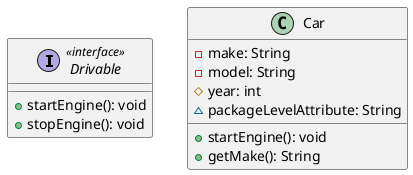
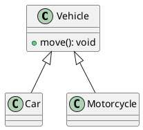
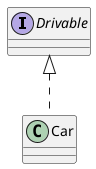
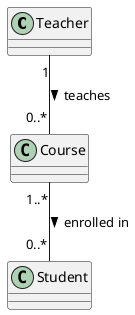
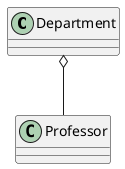
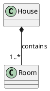
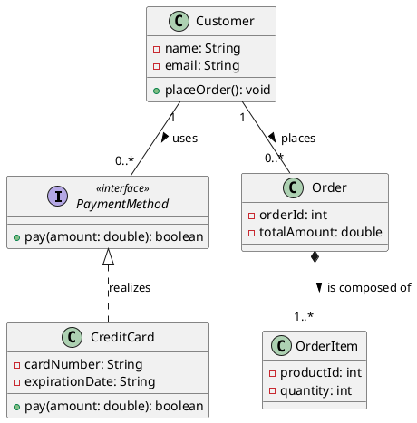

More Notes (WIP):
* [Sequence Diagrams](/SEBook/uml_sequence_diagram.html)
* [State Machine Diagrams](/SEBook/uml_state_diagram.html)
* [Class Diagrams](/SEBook/uml_class_diagram.html)

## 1. Classes, Interfaces, and Modifiers

This snippet demonstrates how to define an interface, a class, and use visibility modifiers (`+`, `-`, `#`, `~`).

---

## 2. Relationships

PlantUML uses different arrow styles to represent the various relationships. The direction of the arrow generally goes from the "child" or "part" to the "parent" or "whole."

### Generalization (Inheritance)
Use `<|--` to draw a solid line with an empty, closed arrowhead.

### Interface Realization (Implementation)
Use `<|..` to draw a dashed line with an empty, closed arrowhead.

### Association and Multiplicities
Use `--` for a standard solid line. You can add quotes around numbers at either end to define the multiplicities, and a colon followed by text to label the association.

### Aggregation
Use `o--` to draw a solid line with an empty diamond pointing to the "whole" class.

### Composition
Use `*--` to draw a solid line with a filled (black) diamond pointing to the "whole" class.

---

## 3. Putting It All Together: A Mini E-commerce Example

Here is a consolidated PlantUML diagram showing how these concepts interact in a simple system design.

---

Would you like me to show you how to add more advanced PlantUML features, like notes, coloring, or packages to organize your classes?

# Class Diagrams 

Class diagrams represent classes and their interactions.

## Classes

Classes are displayed as rectangles with one to three different sections that are each separated by a horizontal line.

The top section is always the name of the class. If the class is abstract, the name is in italics. 

The middle section indicates attributes of the class (i.e., member variables). 

The bottom section should include all methods that are implemented in this class (i.e., for which the implementation of the class contains a method definition). 

Inheritance is visualized using an arrow with an empty triangle pointing to the super class. 

Attributes and methods can be marked as *public* (`+`), *private* (`-`), or *protected* (`#`), to indicate the visibility. 
**Hint:** Avoid public attributes, as this leads to bad design. (Public means every class has access, private means only this class has access, protected means this class and its sub classes have access) 

When a class uses an association, the name and visibility of the attribute can be written either next to the association or in the attribute section, or both (but only if it is done consistently). Writing it on the Association is more common since it increases the readability of the diagram.

Please include types for arguments and a meaningful parameter name. Include return types in case the method returns something (e.g., `+ calculateTax(income: int): int`) 

## Interfaces

Interfaces are classes that do not have any method definitions and no attributes. Interfaces only contain method declarations. Interfaces are visualized using the `<<interface>>` stereotype

To realize an interface, use the arrow with an empty triangle pointing to the interface and a dashed line.

# Sequence Diagrams 

Sequence diagrams display the interaction between concrete objects (or component instances). 

They show one **particular example of interactions** (potentially with optional, alternative, or looped behavior when necessary). Sequence diagrams are not intended to show ALL possible behaviors since this would become very complex and then hard to understand.

Objects / component instances are displayed in rectangles with the label following this pattern: `objectName: ClassName`. If the name of the object is irrelevant, then you can just write `: Classname`. 

When showing interactions between objects then all arrows in the sequence diagram represent method calls being made between the two objects. So an arrow from the client object with the name handleInput to the state objects means that somewhere in the code of the class of which client is an instance of, there is a method call to the handleInput method on the object state. Important: These are interactions between particular objects, not just generally between classes. It's always one concrete instance of this class. 

The names shown on the arrows have to be consistent with the method names shown in the class diagram, including the number or arguments, order of arguments, and types of arguments. Whenever an arrow with method x and arguments of type Y and Z are received by an object o, then either the class of which o is an instance of or one of its super classes needs to have an implementation of `x(Y,Z)`.     

It is a modeling choice to decide whether you want to include concrete values (e.g., `calculateTax(1400)`) or meaningful variable names (e.g., `calculateTax(income)`). If you reference a real variable that has been used before, please make sure to ensure it is the same one and it has the right type. 

# State Machine Diagrams 

State machines model the transitions between different states. States are modeled either as oval, rectangles with rounded corners, or circles. 

Transitions follow the pattern `[condition] trigger / action`. 

State machines always need an initial state but don't always need a final state. 