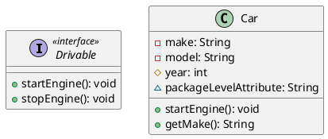
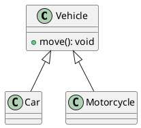
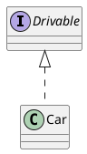
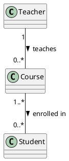
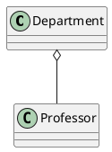
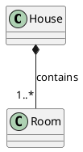
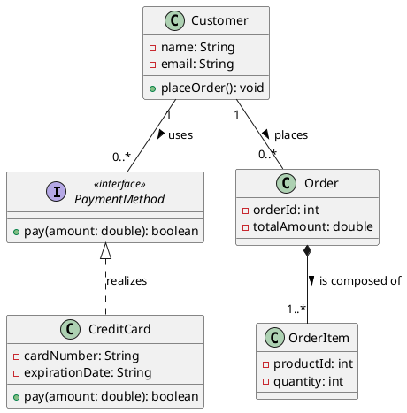

# Introduction

*Pedagogical Note: This chapter is designed using principles of **Active Engagement** (frequent retrieval practice). We will build concepts incrementally. Please complete the "Concept Checks" without looking back at the text—this introduces a "desirable difficulty" that strengthens long-term memory.*

## 🎯 Learning Objectives
By the end of this chapter, you will be able to:
1. Translate real-world object relationships into UML Class Diagrams.
2. Differentiate between structural relationships (Association, Aggregation, Composition).
3. Read and interpret system architecture from UML class diagrams.


## Diagram -- The Blueprint of Software 

Imagine you are an architect designing a complex building. Before laying a single brick, you need blueprints. In software engineering, we use similar models. The **Unified Modeling Language (UML)** is the most common one. 
Among UML diagrams, **Class Diagrams** are the most common ones, because they are very close to the code. They describe the static structure of a system by showing the system's classes, their attributes, operations (methods), and the relationships among objects.


## The Core Building Blocks

### 2.1 Classes
A **Class** is a template for creating objects. In UML, a class is represented by a rectangle divided into three compartments:
1. **Top:** The Class Name.
2. **Middle:** Attributes (variables/state).
3. **Bottom:** Operations (methods/behavior).

### 2.2 Modifiers (Visibility)
To enforce *encapsulation*, UML uses symbols to define who can access attributes and operations:
* `+` **Public**: Accessible from anywhere.
* `-` **Private**: Accessible only within the class.
* `#` **Protected**: Accessible within the class and its subclasses.
* `~` **Package/Default**: Accessible by any class in the same package.

**ASCII UML: A User Class**
```text
+-------------------------+
|          User           |  <-- Class Name
+-------------------------+
| - username: String      |  <-- Private Attribute
| - email: String         |
| # id: int               |  <-- Protected Attribute
+-------------------------+
| + login(): boolean      |  <-- Public Operation
| + resetPassword(): void |
+-------------------------+
```

### 2.3 Interfaces
An **Interface** represents a contract. It tells us *what* a class must do, but not *how* it does it. It is denoted by the `<<interface>>` stereotype. Interfaces typically only have method signatures, no attributes.

**ASCII UML: A Payable Interface**
```text
+-------------------------+
|      <<interface>>      |
|        Payable          |
+-------------------------+
| + processPayment(): bool|
+-------------------------+
```

> 🧠 **Concept Check 1 (Retrieval Practice)**
> *Cover the screen above. What do the symbols `+`, `-`, and `#` stand for? Why does an interface lack an attributes compartment?*


## Connecting the Dots: Relationships

Software is never just one class working in isolation. Classes interact. We represent these interactions with different types of lines and arrows. 

*(Pedagogical Note: We are segmenting relationships into two categories to manage cognitive load: "Is-A" relationships and "Has-A" relationships).*

### Category 1: "Is-A" Relationships (Inheritance)

**1. Generalization (Inheritance)**
Generalization connects a subclass to a superclass. It means the subclass inherits attributes and behaviors from the parent. 
* **UML Symbol:** A solid line with a hollow, closed arrow pointing to the parent. `----|>`

**2. Interface Realization**
When a class agrees to implement the methods defined in an interface, it "realizes" the interface.
* **UML Symbol:** A dashed line with a hollow, closed arrow pointing to the interface. `- - -|>`

**ASCII UML: Generalization and Realization**
```text
   +-------------------------+
   |      <<interface>>      |
   |        Vehicle          |
   +-------------------------+
               ^
               |  (Realization: Dashed line conceptually)
               | - - - - - - - - - - - 
   +-------------------------+       |
   |           Car           |       |
   +-------------------------+       |
   | - make: String          |       |
   +-------------------------+       |
   | + startEngine(): void   |- - - -+
   +-------------------------+
               ^
               |  (Generalization: Solid line)
              / \
             +---+
               |
      +--------+--------+
      |                 |
+------------+   +-------------+
|  Sedan     |   |    SUV      |
+------------+   +-------------+
```

### Category 2: "Has-A" / "Knows-A" Relationships

**1. Association**
A basic structural relationship indicating that objects of one class are connected to objects of another (e.g., a "Teacher" knows about a "Student"). 
* **UML Symbol:** A simple solid line. `---------`

**2. Multiplicities**
Along association lines, we use numbers to define *how many* objects are involved.
* `1` : Exactly one
* `0..1` : Zero or one
* `*` or `0..*` : Zero to many
* `1..*` : One to many

**ASCII UML: Association with Multiplicities**
```text
+---------+                 +---------+
| Author  | 1          1..* |  Book   |
+---------+-----------------+---------+
(One Author can write One or Many Books)
```

**3. Aggregation (Weak "Has-A")**
A specialized association where one class belongs to a collection, but the parts can exist independently of the whole. If a University closes down, the Professors still exist.
* **UML Symbol:** A solid line with an **empty diamond** at the "whole" end. `<>-------`

**ASCII UML: Aggregation**
```text
+------------+          +------------+
| University |<>--------| Professor  |
+------------+          +------------+
```

**4. Composition (Strong "Has-A")**
A strict relationship where the parts *cannot* exist without the whole. If you destroy a House, the Rooms inside it are also destroyed.
* **UML Symbol:** A solid line with a **filled diamond** at the "whole" end. `<*>------` (Using `<*>` to represent a filled/black diamond).

**ASCII UML: Composition**
```text
+------------+          +------------+
|   House    |<*>-------|    Room    |
+------------+          +------------+
```

> 🧠 **Concept Check 2 (Self-Explanation)**
> *In your own words, explain the difference between the empty diamond (Aggregation) and the filled diamond (Composition). Give a real-world example of each that is not mentioned in this text.*

---

## 4. Putting It All Together: The E-Commerce System

*Pedagogical Note: We are now combining isolated concepts into a complex schema. This reflects how you will encounter UML in the real world.*

Let's read the architectural blueprint for a simplified E-Commerce system.

**ASCII UML: Full System Architecture**
```text
                         +-------------------+
                         |   <<interface>>   |
                         |     Billable      |
                         +-------------------+
                                   ^
                                   | - - - - - - - - - - - - - +
                                                               |
+-----------------+ 1      0..* +-----------------+            |
|    Customer     |-------------|      Order      | - - - - - -+
+-----------------+             +-----------------+
| - id: int       |             | - date: Date    |
| - name: String  |             | - status: String|
+-----------------+             +-----------------+
| + placeOrder()  |             | + calcTotal()   |
+-----------------+             +-----------------+
        ^                               | <*>
        |                               |  | (Composition)
       / \                              |  |
      +---+                             |  | 1..*
        |                       +-----------------+
  +-----+-----+                 |    LineItem     |
  |           |                 +-----------------+
+------+  +-------+             | - quantity: int |
| VIP  |  | Guest |             +-----------------+
+------+  +-------+                     |
                                        | 1
                                        |
                                        | 1
                                +-----------------+
                                |     Product     |
                                +-----------------+
                                | - price: float  |
                                | - name: String  |
                                +-----------------+
```

### System Walkthrough:
1. **Generalization:** `VIP` and `Guest` are specific types of `Customer`.
2. **Association (Multiplicity):** `1` Customer can have `0..*` (zero to many) Orders.
3. **Interface Realization:** `Order` implements the `Billable` interface.
4. **Composition:** An `Order` strongly contains `1..*` (one or more) `LineItem`s. If the order is deleted, the line items are deleted.
5. **Association:** Each `LineItem` points to exactly `1` `Product`.

---

## 5. Chapter Review & Spaced Practice

To lock this information into your long-term memory, do not skip this section! 

**Active Recall Challenge:**
Grab a blank piece of paper. Without looking at this chapter, try to draw the UML Class Diagram for the following scenario:
1. A **School** is composed of one or many **Department**s (If the school is destroyed, departments are destroyed).
2. A **Department** aggregates many **Teacher**s (Teachers can exist without the department).
3. **Teacher** is a subclass of an **Employee** class.
4. The **Employee** class has a private attribute `salary` and a public method `getDetails()`.

*Review your drawing against the rules in sections 2 and 3. How did you do? Identifying your own gaps in knowledge is the most powerful step in the learning process!*


## 1. Classes, Interfaces, and Modifiers

This snippet demonstrates how to define an interface, a class, and use visibility modifiers (`+`, `-`, `#`, `~`).



---

## 2. Relationships

PlantUML uses different arrow styles to represent the various relationships. The direction of the arrow generally goes from the "child" or "part" to the "parent" or "whole."

### Generalization (Inheritance)
Use `<|--` to draw a solid line with an empty, closed arrowhead.



### Interface Realization (Implementation)
Use `<|..` to draw a dashed line with an empty, closed arrowhead.



### Association and Multiplicities
Use `--` for a standard solid line. You can add quotes around numbers at either end to define the multiplicities, and a colon followed by text to label the association.



### Aggregation
Use `o--` to draw a solid line with an empty diamond pointing to the "whole" class.



### Composition
Use `*--` to draw a solid line with a filled (black) diamond pointing to the "whole" class.



---

## 3. Putting It All Together: A Mini E-commerce Example

Here is a consolidated PlantUML diagram showing how these concepts interact in a simple system design.



---

Would you like me to show you how to add more advanced PlantUML features, like notes, coloring, or packages to organize your classes?


# Class Diagrams 

Class diagrams represent classes and their interactions.

## Classes

Classes are displayed as rectangles with one to three different sections that are each separated by a horizontal line.

The top section is always the name of the class. If the class is abstract, the name is in italics. 

The middle section indicates attributes of the class (i.e., member variables). 

The bottom section should include all methods that are implemented in this class (i.e., for which the implementation of the class contains a method definition). 

Inheritance is visualized using an arrow with an empty triage pointing to the super class. 

Attributes and methods can be marked as *public* (`+`), *private* (`-`), or *protected* (`#`), to indicate the visibility. 
**Hint:** Avoid public attributes, as this leads to bad design. (Public means every class has access, private means only this class has access, protected means this class and its sub classes have access) 

When a class uses an association, the name and visibility of the attribute can be written either next to the association or in the attribute section, or both (but only if it is done consistently). Writing it on the Association is more common since it increases the readability of the diagram.

Please include types for arguments and a meaningful parameter name. Include return types in case the method returns something (e.g., `+ calculateTax(income: int): int`) 

## Interfaces

Interfaces are classes that do not have any method definitions and no attributes. Interfaces only contain method declarations. Interfaces are visualized using the `<<interface>>` stereotype

To realize an interface, use then arrow with an empty triage pointing to the interface and a dashed line.

# Sequence Diagrams 

Sequence diagrams display the interaction between concrete objects (or component instances). 

They show one **particular example of interactions** (potentially with optional, alternative, or looped behavior when necessary). Sequence diagrams are not intended to show ALL possible behaviors since this would become very complex and then hard to understand.

Objects / component instances are displayed in rectangles with the label following this pattern: `objectName: ClassName`. If the name of the object is irrelevant, then you can just write `: Classname`. 

When showing interactions between objects then all arrows in the sequence diagram represent method calls being made between the two objects. So an arrow from the client object with the name handleInput to the state objects means that somewhere in the code of the class of which client is an instance of, there is a method call to the handleInput method on the object state. Important: These are interactions between particular objects, not just generally between classes. It's always on concrete instance of this class. 

The names shown on the arrows have to be consistent with the method names shown in the class diagram, including the number or arguments, order of arguments, and types of arguments. Whenever an arrow with method x and arguments of type Y and Z are received by an object o, then either the class of which o is an instance of or one of its super classes needs to have an implementation of `x(Y,Z)`.     

It is a modeling choice to decide whether you want to include concrete values (e.g., `caclulateTax(1400)`) or meaningful variable names (e.g., `calculateTax(income)`). If you reference a real variable that has been used before, please make sure to ensure it is the same one and it has the right type. 

# State Machine Diagrams 

State machines model the transitions between different states. States are modeled either as oval, rectangles with rounded corners, or circles. 

Transitions follow the patter `[condition] trigger / action`. 

State machines always need an initial state but don't always need a final state. 